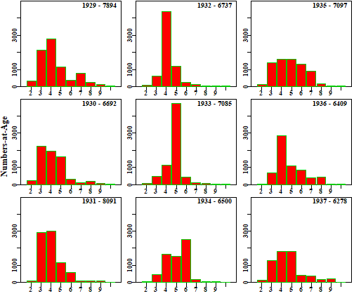
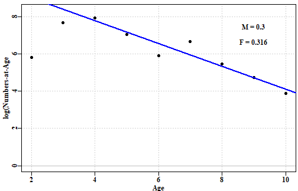
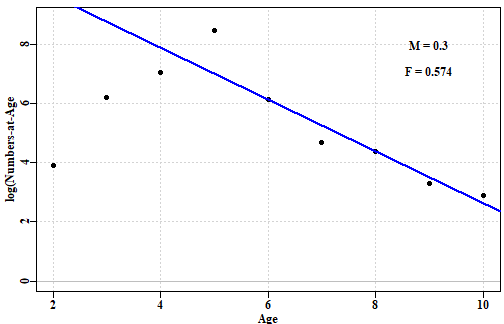
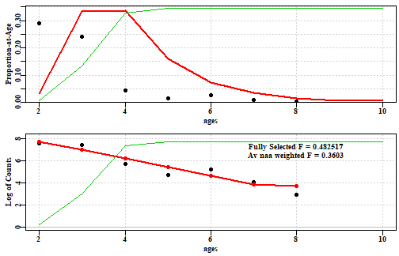

## Introduction

### Which Assessment to Apply

Which stock assessment method to apply to fisheries for data-poor to data-moderate species will depend upon what fisheries and biological data are available but also, importantly, on what management objectives need to be met within the jurisdiction in question. It may be the case that the fishery for a particular species is of sufficient size and value to warrant on-going monitoring and management towards some defined goal for the stock. In such a case the assessment used should obviously be capable of generating some notion of the current state of the fishery and indicate what management actions may be required to eventually achieve the agreed management goals. But some fisheries may be so minor that trying to actively manage them would be inefficient. Nevertheless, to meet the requirements of the Status of key Australian Fish Stocks (SAFS) one still requires some form of defensible stock assessment capable of determining whether the current level of fishing is sustainable.     

## Catch Curve Analyses

Catch curves are an assessment approach that has a relatively long history. The ideas behind them is very simple. If the total population concerned received constant recruitment and a constant mortality rate each year, such an equilibrium assumption would imply that all cohorts would be identical and the numbers in each age class would be expected to decline exponentially. It is possible to follow the fate of a single cohort through a number of years or consider multiple cohorts in a single year and both of those options 

$${{N}_{t}}={{N}_{0}}{{e}^{-(M+F)t}}={N}_{0}{e}^{-Zt}={N}_{t-1}{e}^{-Z}$$
where _N~t~_ is the numbers at a particular age (a cohort) _t_, _M_ is the natural mortality, _F_ is the age-specific fishing mortality, _Z_ is the age-specific total mortality. This relationship can be linearized through log-transformation.

$$Log({N}_{t})=Log({N}_{0})-Zt$$
which is obviously a simple linear regression. This means if one assumes that fishing mortality and natural mortality have been constant and one has the age-composition of the catch in a single year if one plots up the log-transformed numbers-at-age and plot those against age then the gradient of a linear regression through the data will provide an estimate of total mortality. This can be illustrated through the use of a particular data set and we will use one of the built in data sets: plaice.


```r
# library(datalowSA)
data(plaice)
str(plaice,max.level=1)
```

```
## List of 5
##  $ fish   :'data.frame':	9 obs. of  4 variables:
##  $ glb    :List of 18
##  $ props  :'data.frame':	11 obs. of  6 variables:
##  $ agedata:List of 5
##  $ lendata:List of 5
```

```r
naa <- plaice$agedata$naa
pick <- which(naa[,"sex"] == 1)
yrs <- naa[pick,"year"]
naa <- naa[pick,3:11]
ages <- plaice$agedata$ages
#plotprep()
compyear(naa,yrs,ages,plots=c(3,3),freq=TRUE,border=3)
```



__Figure 1.__ Numbers-at-age for each year of data from the plaice data set.


When the age data from the plaice data set are considered it is  clear that the notion of a exponential decline is only approximated by this real data. Such deviations from the theoretical expectation derive from the fact that real populations are not in equilibrium and recruitment is not a constant. For example, a strong year class becomes apparent in the 1932 year and the progression is relatively easily seen through 1933 and 1934. So the dynamics appears to be realistic although the assumptions about equilibrium do not appear to be valid. Despite this we can use this data to illustrate the use of the catch curves. 

A standard workflow when using catch curves might consist of:

1. read in age composition data (and natural mortality depending)
2. visualize that age composition using the function __compyear__. 
2. use __naiveCC__ for the classical catch curve.
3. alternatively use __selectCC__ where the selectivity is estimated as well as the gradient of decline.
 

## Application of The Classical Catch Curves

One obvious aspect of the age composition data illustrated in __Figure 1__ is that the earlier ages classes are less common than later age classes. This is a reflection of the effects of selectivity on what gets caught. The classical catch curve primarily involves fitting a linear regression to the log-transformed numbers-at-age. Given the effect of selectivity it would be invalid to simply fit a regression to all age data. To avoid the effects of selectivity the classical catch curve requires one to select an age from which to fit the regression.


```r
M <- plaice$glb$M
pickage <- 4  # try repeating this but compare with pickage = 3
numaa <- naa[1,]   # repeat this using different years of data
out <- classicCC(M,ages,numaa,pickage,plot=TRUE)
```



__Figure 2.__ The classical catch curve applied to the age data from 1929, from the plaice data set. The age at which the regression line begins to be fitted in the plot was age 4 (_pickage_ = 4). If a _pickage_ of 3 was chosen the regression line would be somewhat steeper, which would have implied a higher fishing mortality rate.

If the `classicCC` is applied to each of the nine years of data it would be important to use the same _pickage_. In some cases (possibly 1932 - 1934) the strong year class can disrupt this analysis by suggesting that selectivity only operates from a much older _pickage_.


```r
M <- plaice$glb$M
pickage <- 4   # try repeating this but compare with pickage = 4
numaa <- naa[5,]   # repeat this using different years of data
out <- classicCC(M,ages,numaa,pickage,plot=TRUE)
```



__Figure 3.__ The classical catch curve applied to the age data from 1933, from the plaice data set. The age at which the regression line begins to be fitted in the plot was age 4 (_pickage_ = 4). If considered alone this plot appears to suggest that a _pickage_ of 5 might be chosen, but that would be merely a reflection of the strong year class rather than the original pickage of 4.


```r
print(out)
```

```
## $FF
## ages[pickA] 
##    0.573941 
## 
## $coef
## Intercept         Z 
## 11.380375 -0.873941 
## 
## $regress
## 
## Call:
## lm(formula = log(freqs[pickA]) ~ ages[pickA])
## 
## Coefficients:
## (Intercept)  ages[pickA]  
##     11.3804      -0.8739
```

By comparing _Figures 2 and 3_ it should be clear that only having a single year of catch age composition data would include a risk that the interpretation of the selectivity within the fishery concerned may be biased. The interpretation of catch curves becomes compromised by the presence of very strong year classes and their presence usually means use of catch curves becomes invalid.

## Inclusion of Selectivity in Catch Curves


```r
data(plaice)
glb <- plaice$glb
naa <- plaice$agedata$naa
pick <- which(naa[,"sex"] == 1)
naa <- naa[pick,3:11]
numaa <- naa[2,] 
pars <- c(A50=3.0,delta=0.5,fcur=0.6)
out <- selectCC(glb$M,glb$maxage,numaa,pars,plot=TRUE)
```



__Figure 4.__ This catch curve uses a simple age-structured model to include the estimation of selectivity from the age data. It provides an estimate of fully selected fishing mortality rather than an average fishing mortality applied to all included age classes (as in the classicCC).


```r
print(out)
```

```
## $best
## $best$par
##       A50     delta      fcur 
## 3.1352400 0.8697291 0.4824969 
## 
## $best$value
## [1] 10589.32
## 
## $best$counts
## function gradient 
##      118       NA 
## 
## $best$convergence
## [1] 0
## 
## $best$message
## NULL
## 
## 
## $result
##    counts predcounts logcount logpredcount        pCAA    predpCAA Selectivity        FaA
## 2     223  212.70507 5.407172     5.359907 0.033323371 0.031784977  0.02097312 0.01011947
## 3    2246 2223.50150 7.716906     7.706838 0.335624626 0.332262628  0.38749588 0.18696557
## 4    1938 2260.22382 7.569412     7.723219 0.289599522 0.337750122  0.94919485 0.45798359
## 5    1620 1076.64722 7.390181     6.981607 0.242080096 0.160885717  0.99819084 0.48162400
## 6     302  493.00629 5.710427     6.200522 0.045128512 0.073670994  0.99993863 0.48246730
## 7     106  225.44424 4.663439     5.418073 0.015839809 0.033688619  0.99999792 0.48249591
## 8     181  103.08744 5.198497     4.635578 0.027047221 0.015404579  0.99999993 0.48249688
## 9      58   47.13806 4.060443     3.853081 0.008667065 0.007043942  1.00000000 0.48249691
## 10     18   39.71440 2.890372     3.681714 0.002689779 0.005934609  1.00000000 0.48249691
```


## Discussion


### Management Advice from Catch Curves


## References

Dick, E.J. and A.D. MacCall (2011) Depletion-based stock reduction analysis: a catch-based method for determining sustainable yields for data-poor fish stocks. _Fisheries Research_ __110__(2): 331-341

Haddon, M. (2014) Tier 4 analyses in the SESSF, including deep water species. Data from 1986 – 2012. Pp 352 – 461 in Tuck, G.N. (ed) (2014) _Stock Assessment for the Southern and Eastern Scalefish and Shark Fishery 2013. Part 2._ Australian Fisheries Management Authority and CSIRO Marine and Atmospheric Research, Hobart. 313p.

Haddon, M., Klaer, N., Wayte, S., and G. Tuck (2015) _Options for Tier 5 approaches in the SESSF and identification of when data support for harvest strategies are inappro-priate._ CSIRO. FRDC Final Report 2013/200. Hobart. 115p.

Kimura, D.K. and J.V. Tagart (1982) Stock Reduction Analysis, another solution to the catch equations. _Canadian Journal of Fisheries and Aquatic Sciences_ __39__: 1467 - 1472.

Kimura, D.K., Balsiger, J.W., and Ito, D.H. 1984. Generalized stock reduction analysis. _Canadian Journal of Fisheries and Aquatic Sciences_ __41__: 1325–1333.

Little, L.R., Wayte, S.E., Tuck, G.N., Smith, A.D.M., Klaer, N., Haddon, M., Punt, A.E., Thomson, R., Day, J. and M. Fuller (2011) Development and evaluation of a cpue-based harvest control rule for the southern and eastern scalefish and shark fishery of Australia. _ICES Journal of Marine Science_ __68__(8): 1699-1705.

Martell, S. and R. Froese (2013) A simple method for estimating MSY from catch and resilience. _Fish and Fisheries_ __14__: 504-514

Punt, A.E., Butterworth, D.S. and A.J. Penney (1995) Stock assessment and risk analysis for the South Atlantic population of albacore _Thunnus alalunga_ using an age-structured production model _South African Journal of Marine Science_ __16__: 287-310. http://dx.doi.org/10.2989/025776195784156476

R Core Team (2017). _R: A language and environment for statistical computing._ R Foundation for Statistical Computing, Vienna, Austria. URL https://www.R-project.org/. see also https://cran.r-project.org/

RStudio (2016)  www.rstudio.com

Schaefer, M.B. (1954) Some aspects of the dynamics of populations important to the management of the commercial marine fisheries. _Bulletin, Inter-American Tropical Tuna Commission_, __1__: 25-56. 

Schaefer, M.B. (1957) A study of the dynamics of the fishery for yellowfin tuna in the Eastern Tropical Pacific Ocean. _Bulletin, Inter-American Tropical Tuna Commission_, __2__: 247-285

Walters, C.J., Martell, S.J.D. and J. Korman (2006) A stochastic approach to stock reduction analysis. _Canadian Journal of Fisheries and Aquatic Sciences_ __63__: 212 - 223.


## Appendix: Catch Curve Equations


