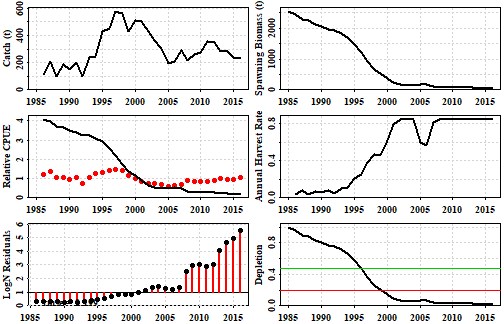
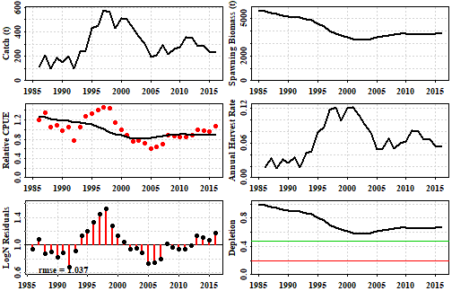
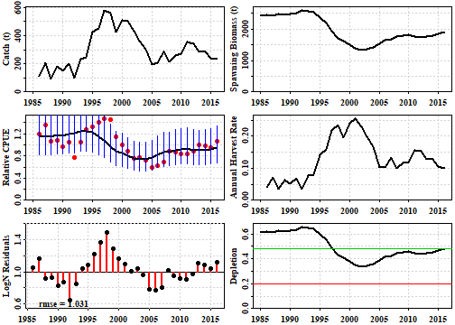
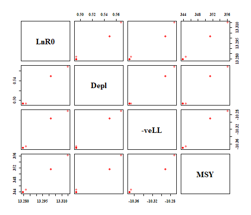
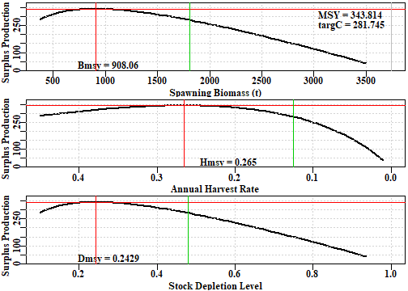
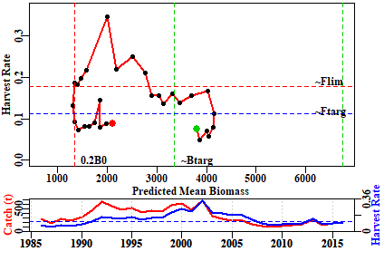
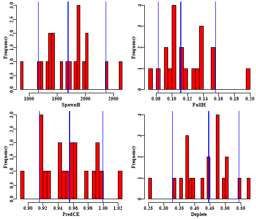
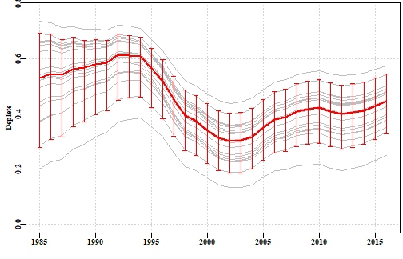

## Introduction

### Which Stock Assessment?

Which stock assessment method to apply to fisheries for data-poor to data-moderate species will depend upon what fisheries and biological data are available but also, importantly, on what management objectives need to be met within the jurisdiction in question. It may be the case that the fishery for a particular species is of sufficient size and value to warrant on-going monitoring and management towards some defined goal for the stock. In such a case the assessment used should obviously be capable of generating some notion of the current state of the fishery and indicate what management actions may be required to eventually achieve the agreed management goals. But some fisheries may be so minor that trying to actively manage them would be inefficient. Nevertheless, to meet the requirements of the Status of key Australian Fish Stocks (SAFS) one still requires some form of defensible stock assessment capable of determining whether the current level of fishing is sustainable.     

## Age-Structured Production Model

### Introduction to ASPM

The age-structured production model (ASPM or __aspm__) is literally a surplus production model which is based upon an age-structured model of production rather than an accumulated biomass model (see the vignette on _spm_).

There are some specific data requirements for fitting an age-structured production model to fishery data. Data from the fishery need to included, as a minimum, an accurate catch time-series plus an index of relative abundance for at least some of the years within the catch time-series. In addition, information (or defensible assumptions) is needed for the species concerned in relation to the description of its natural mortality, its growth, its maturation, and the selectivity of the fishery (maturity and selectivity could be knife-edge). If just the catches and CPUE data are available then one might try fitting a simple, aggregated biomass surplus production model. But if these biological data and information are available then an age-structured production model opens the way to on-going improvements with respect to the inclusion of occasional age-composition data or other observations that could be predicted by a suitable model and hence included in the model fitting process. 

More details on age-structured production models can be found in Punt et al. (1995). The model equations are provided in the appendix. It would be helpful to the user to read the spm vignette as the theory in there also applies to age-structured production models.

### A Typical Workflow

A typical workflow for using an age-structured production model might be something like:

1. read in the available data and use _checkdata_ to ensure it can be used with __aspm__. 
2. search for suitable initial parameter values using _dynamics_, _aspmLL_, and _plotASPM_, this will include deciding on the use of a two parameter model (no initial depletion) or a three parameter model accounting for an initial depletion level.
3. given suitable initial parameters use _fitASPM_ or more basically _optim_ to fit the model to the available data.
4. once successfully fitted it is best to plot the solution to determine visually how close the model fit is to the data using _plotASPM_. One approach to improving this is to include confidence intervals around the index of relative abundance (cpue). This is done first using _getLNCI_ and then including the output of this into _plotASPM_ or, for a closer look in _plotceASPM_. Eventually improved confidence intervals for the model outputs can be obtained using boostrap samples (see below).
5. A better test of the robustness of the solution is to test how sensitive it is to the initial conditions. This can be done by randomly varying the initial parameters and determining whether the model fitting outcomes vary. Suitable example code is given in the vignette.
6. After finally deciding on the overall optimum solution it would be sensible to use the optimum parameters to determine the implied production curve so that management statistics such as MSY, the target catch, and the limit and target reference points can be defined. This can be done using _getProductionC_, the _C_ post-fix denoting this is a C++ function (used for speed), the results of which can be plotted and summarized using _prodASPM_.
7. One can produce a classical phase plot of predicted biomass vs harvest rate to aid in the determination of the stock status, and for this we would use _aspmphaseplot_.
8. Finally, to obtain a better notion of the uncertainty in the analysis, and we can do that using _bootASPM_, which facilitates the application of a bootstrap analysis. 

### An Example

The data requirements for the __aspm__ are described above and for the next example we will use the _dataspm_ built in data set. First we will examine an example using only two parameters (assuming the population begins in an unfished state) and then extend the model fitting to include the possibility of an initially depleted state. The two parameters being fitted are the average unfished recruitment level and the standard deviation of the errors around the CPUE data. 

We load _dataspm_, which contains a dataframe of the catches and CPUE by year (*fish*) and other parameters used for the age-structured production model. 


```r
# library(datalowSA)
data(dataspm)
fish <- dataspm$fish
props <- dataspm$props # length-, weight-, maturity- and selectivity-at-age
```

While a simple, aggregated biomass surplus production model only requires the specification of the species name in the _glb_ data object an __aspm__ requires information on the growth, selectivity, weight-at-age, steepness of the stock-recruit relationship and natural mortality. The global parameters (_glb_), in addition to the _spsname_, need to contain the population ages (*maxage* and _ages_), natural mortality (*M*), von Bertalanffy growth parameters (*Linf*, _K_ and _t0_), weight-at-age parameters (*Waa* and _Wab_), age at 50% maturity, delta (*M50a* and _deltaM_), age that 50% of the population are selected by the gear and delta (*sela50* and _deltaS_) and the _steepness_ of the stock-recruitment relationship. The number of years (*nyrs*) of over which catch and CPUE are available (including missing years) is calculated from the *fish* dataframe. A starting value for the log of the initial recruitment (*R0*) also needs to be provided, although this will be estimated along with the standard deviation of the errors around the CPUE data. 

We inspect the global parameters specified in _dataspm_.


```r
(glb <- dataspm$glb)
```

```
## $maxage
## [1] 20
## 
## $M
## [1] 0.225
## 
## $Linf
## [1] 103.4
## 
## $K
## [1] 0.2
## 
## $t0
## [1] -3.139
## 
## $Waa
## [1] 0.0029
## 
## $Wab
## [1] 3.139
## 
## $M50a
## [1] 5
## 
## $deltaM
## [1] 2.5
## 
## $steep
## [1] 0.75
## 
## $R0
## [1] 13.7
## 
## $sela50
## [1] 3.5
## 
## $deltaS
## [1] 1
## 
## $resilience
## [1] "low"
## 
## $nages
## [1] 21
## 
## $ages
##  [1]  0  1  2  3  4  5  6  7  8  9 10 11 12 13 14 15 16 17 18 19 20
## 
## $nyrs
## [1] 31
## 
## $spsname
## [1] "TrawlCaught_Scalefish"
```

Just as with the __spm__ model Fitting an __aspm__ model entails first finding initial parameter estimates that lead to predicted cpue time-series that approximate the observed series. Thus, one might begin something like this and uses aspmLL to determine the negative log-likelihood (-verLL), then _dynamics_ to calculate the dynamics of the __aspm__, and finally _plotASPM_ to illustrate the quality of fit to help decide whether changes are required to the initial guesses.:


```r
pars <- c(12.9,0.25)
aspmLL(pars,infish=fish,inglb=glb,inprops=props)
```

```
## [1] 386.8754
```

```r
fishery <- dynamics(pars,infish=fish,inglb=glb,inprops = props)
plotASPM(fishery)
```



__Figure 1.__ The outcome of a first guess at a two parameter version of the __aspm__. clearly the fit is very poor and the strong trends in the predicted cpue, the log-normal residuals, and the annual harvest rate bumping up against the built-in upper limit of 0.85 across numerous years, provide a strong indication that the initial guess at unfished average recruitment parameter (_R0_) is too small. Try increasing it slowly to see its effect on the model fit to the data.

Once reasonable starting values have been found for the parameters ($R_0$ the unfished average recruitment and $\hat\sigma_{I}$, the standard deviation associated with fitting the observed cpue) then an attempt at fitting the model to the data formally can be made using code something like this:


```r
pars <- c(13.7,0.19)
ans <- fitASPM(pars,infish=fish,inglb=glb,inprops=props)
outoptim(ans) # a tidier way of printing the list output from optim
```

```
## $par         :  13.69138 0.189471 
## $value       :  -7.582633 
## $counts      :  55 NA   iterations, gradient
## $convergence :  0 
## $message     :
```

```r
fishery <- dynamics(ans$par,infish=fish,inglb=glb,inprops = props)
```


__Table 1.__ The output from the _fitASPM_ function and the _dynamics_ function.

```r
kable(fishery,digits=c(0,3,3,3,3,3,4,4,3))
```

      Year   Catch   PredC     SpawnB   ExploitB   FullH     CPUE   PredCE   Deplete
---  -----  ------  ------  ---------  ---------  ------  -------  -------  --------
0     1985                   5643.463   6216.733                               1.000
1     1986   112.9   112.9   5547.856   6119.538   0.018   1.2006   1.2731     0.983
2     1987   206.3   206.3   5381.150   5955.372   0.034   1.3547   1.2532     0.954
3     1988    95.7    95.7   5325.183   5910.455   0.016   1.0585   1.2196     0.944
4     1989   183.1   183.1   5208.120   5799.303   0.031   1.0846   1.2104     0.923
5     1990   147.4   147.4   5136.775   5735.954   0.025   0.9738   1.1876     0.910
6     1991   198.9   198.9   5034.632   5638.377   0.035   1.0437   1.1747     0.892
7     1992   102.1   102.1   5027.222   5638.064   0.018   0.7759   1.1547     0.891
8     1993   235.5   235.5   4914.029   5523.921   0.042   1.0532   1.1546     0.871
9     1994   247.8   247.8   4801.433   5414.330   0.045   1.2840   1.1312     0.851
10    1995   426.8   426.8   4552.038   5165.789   0.079   1.3327   1.1088     0.807
11    1996   448.0   448.0   4310.173   4933.418   0.087   1.4014   1.0579     0.764
12    1997   577.4   577.4   3991.273   4623.718   0.117   1.4687   1.0103     0.707
13    1998   558.5   558.5   3726.747   4374.663   0.121   1.4493   0.9469     0.660
14    1999   427.9   427.9   3607.166   4275.655   0.098   1.1420   0.8959     0.639
15    2000   509.3   509.3   3447.541   4121.138   0.119   0.9957   0.8756     0.611
16    2001   502.4   502.4   3314.139   3991.335   0.122   0.8818   0.8440     0.587
17    2002   429.6   429.6   3256.173   3938.955   0.108   0.7635   0.8174     0.577
18    2003   360.2   360.2   3264.635   3951.252   0.091   0.7668   0.8066     0.578
19    2004   306.2   306.2   3319.664   4007.258   0.077   0.7198   0.8092     0.588
20    2005   195.7   195.7   3460.581   4149.242   0.049   0.5997   0.8206     0.613
21    2006   210.0   210.0   3578.106   4256.624   0.051   0.6336   0.8497     0.634
22    2007   287.3   287.3   3615.276   4278.291   0.067   0.6936   0.8717     0.641
23    2008   214.2   214.2   3698.766   4357.911   0.050   0.8894   0.8761     0.655
24    2009   260.6   260.6   3733.374   4387.110   0.060   0.8644   0.8924     0.662
25    2010   272.2   272.2   3751.418   4403.947   0.062   0.8442   0.8984     0.665
26    2011   356.9   356.9   3696.506   4346.717   0.081   0.8427   0.9019     0.655
27    2012   345.0   345.0   3654.393   4308.073   0.079   0.8849   0.8902     0.648
28    2013   282.7   282.7   3669.508   4331.070   0.066   0.9964   0.8822     0.650
29    2014   285.1   285.1   3686.377   4351.140   0.066   0.9804   0.8869     0.653
30    2015   237.8   237.8   3742.829   4410.295   0.055   0.9570   0.8911     0.663
31    2016   233.3   233.3   3799.558   4464.794   0.053   1.0629   0.9032     0.673

Note the predicted catches are identical to the observed catches. The catches are assumed to be known accurately and so as to ensure a close match between the predicted and observed catches _aspmLL_ has a simple sum-of-squared deviations penalty built into it (try _aspmLL_, without brackets in the console). This is usually sufficient to force the solution to generate a close match once plausible parameter values are found. Note that with respect to reproduction only the average unfished recruitment is estimated. In its current form the __aspm__ cannot take into accoutn strong and weak cohorts; this remains a very simple model of the dynamics. 

To visualize the output of the model fitting we can plot some of the variables from the fishery information generated by the _dynamics_ function.


```r
plotASPM(fishery,CI=NA)
```



__Figure 2.__ The outcome of fitting a two parameter age-structured production model to the available data. Included is a plot of the catch history, the predicted spawning biomass, the CPUE, the harvest rate, the log-normal residuals for the cpue, and the predicted depletion.

The two-parameter model manages to capture the main cpue trends but fails to capture some of the more obvious and more rapid consistent changes in cpue (__Figure 2__). The example fishery in question was known to have been fished prior to 1985 so in the year the data begin to be available the stock can be expected to be depleted to some extent. Thus, an alternative might be to fit the model using three parameters. The first approach, with only one parameter of real interest, required data from the beginning of the fishery. However, there are many fisheries for which data are only available after the fishery has been running for a number of years. In such cases it is necessary to estimate the level of depletion and its effect upon recruitment and thus requires two parameters of interest to the dynamics. The first is, as before, the unfished recruitment level, $R_0$, but then we use a parameter that defines the initial depletion at the start of the observations ($D_{init}$. If this parameter is present in _pars_ a search is made for the constant harvest rate that when applied to the initial unfished stock leads to the predicted initial depletion level, only then does the model fitting proceed. Any initial depletion will influence the recruitment depending on the assumed steepness of the stock recruitment relationship, which is assumed to be a Beverton-Holt relationship. The _dataspm_ data set is not particularly suited to a two-parameter model even though that arrangement was able to provide a result; these assessments should not be done automatically, it always takes some background knowledge to ensure that any methods or choices applied are valid.

As an alternative two-parameter example, the deep water fishery data _data(fishdat)_ was a fishery with catch data from the very start of the fishery, which means it is better suited to using a simple two parameter model


```r
data(fishdat)
fish <- fishdat$fish
glb <- fishdat$glb
props <- fishdat$props
pars <- c(14,0.3)
ans <- fitASPM(pars,infish=fish,inglb=glb,inprops = props)
str(ans)
```

```
## List of 5
##  $ par        : num [1:2] 13.983 0.296
##  $ value      : num 3.61
##  $ counts     : Named int [1:2] 71 NA
##   ..- attr(*, "names")= chr [1:2] "function" "gradient"
##  $ convergence: int 0
##  $ message    : NULL
```

The output contains the estimates of the optimum parameters, the final log-likelihood estimate, the number of iterations it needed to find the optimum, and some diagnostic information. The statement _convergence: int 0_ implies the solution appears valid, and no warning messages is also encouraging; but see later concerning how to test the robustness of such model fitting. If we put the fitted optimum parameters into the function _dynamics_ we can see the time-series of the more important population variables implied by the model fit.


```r
fishery <- dynamics(ans$par,infish=fish,inglb=glb,inprops = props)
print(fishery)
```

```
##    Year    Catch    PredC     SpawnB   ExploitB       FullH  CPUE    PredCE    Deplete
## 0  1985       NA       NA 18014.3343 17692.9772          NA    NA        NA 1.00000000
## 1  1986 3924.912 3924.912 14248.1815 13994.0086 0.221834458    NA 7.5534926 0.79093578
## 2  1987 5117.988 5117.988  9428.1199  9259.9319 0.365727087    NA 5.9743275 0.52336765
## 3  1988 4722.200 4722.200  5129.7882  5038.2780 0.509960552    NA 3.9532537 0.28476146
## 4  1989 1365.128 1365.128  4105.4943  4032.2565 0.270951303 1.490 2.1509436 0.22790153
## 5  1990  801.567  801.567  3641.6743  3576.7106 0.198788694 1.849 1.7214525 0.20215425
## 6  1991  625.407  625.407  3369.2234  3309.1199 0.174855356 1.501 1.5269706 0.18703014
## 7  1992 1108.241 1108.241  2706.9928  2658.7028 0.334905056 2.997 1.4127308 0.15026882
## 8  1993  964.409  964.409  2201.0514  2161.7869 0.362736665 1.415 1.1350544 0.12218333
## 9  1994  800.618  800.618  1858.5047  1825.3509 0.370350097 1.139 0.9229109 0.10316811
## 10 1995  962.399  962.399  1413.4866  1388.2714 0.527240531 0.700 0.7792795 0.07846455
## 11 1996 1180.349 1180.031   845.1272   830.0510 0.850000000 0.469 0.5926814 0.04691415
## 12 1997  297.003  297.003   925.2859   908.7798 0.357812970 0.303 0.3543657 0.05136387
## 13 1998  316.131  316.131  1007.3327   989.3629 0.347863150 0.356 0.3879766 0.05591839
## 14 1999  210.529  210.529  1165.5750  1144.7824 0.212792499 0.390 0.4223792 0.06470264
## 15 2000  169.337  169.337  1365.7195  1341.3565 0.147920693 0.439 0.4887309 0.07581293
## 16 2001  200.843  200.843  1559.2787  1531.4628 0.149731266 0.489 0.5726524 0.08655767
## 17 2002  255.735  255.735  1722.4298  1691.7035 0.166987404 0.431 0.6538127 0.09561440
## 18 2003  217.502  217.502  1916.3659  1882.1799 0.128569815 0.520 0.7222227 0.10638006
## 19 2004  283.110  283.110  2064.4787  2027.6505 0.150416013 0.777 0.8035410 0.11460200
## 20 2005  264.607  264.607  2225.4211  2185.7219 0.130499311 1.322 0.8656453 0.12353613
## 21 2006  139.316  139.316  2484.5623  2440.2403 0.063739124 1.412 0.9331292 0.13792141
## 22 2007   28.571   28.571  2838.9456  2788.3017 0.011708273    NA 1.0417883 0.15759370
## 23 2008    3.331    3.331  3224.2908  3166.7728 0.001194634    NA 1.1903828 0.17898473
## 24 2009   13.859   13.859  3608.1895  3543.8231 0.004376380    NA 1.3519599 0.20029547
## 25 2010   21.440   21.440  3988.2950  3917.1480 0.006049963    NA 1.5129303 0.22139564
## 26 2011   31.426   31.426  4358.7341  4280.9788 0.008022674    NA 1.6723103 0.24195921
## 27 2012   17.253   17.253  4737.4411  4652.9301 0.004030153    NA 1.8276371 0.26298175
## 28 2013   35.940   35.940  5093.6492  5002.7837 0.007724165    NA 1.9864307 0.28275534
## 29 2014   22.087   22.087  5453.1544  5355.8757 0.004414942    NA 2.1357903 0.30271196
## 30 2015   16.206   16.206  5806.4445  5702.8635 0.003025836    NA 2.2865325 0.32232357
```

The use of _fitASPM_ is basically shorthand for using _bestL <- optim(pars, aspmLL, method="Nelder-Mead", infish=fish, inglb=glb, inprops=props, control=list(maxit = 1000, parscale = c(10,1)))_ twice in a row. Examine its code by using _fitASPM_ without brackets in the R console window.

Note that the harvest rate in 1996 appears to have bumped up against the upper limit of 0.85 hard wired into the R-code (try typing _dynamics_ into the R console without brackets to see the code). So that 1180 tonnes catch in 1996 was likely to be damaging. However, the predicted catch is only slightly less than the reported catch so this spike in harvest rate has some support in the data. Plotting up the fishery results enables the visualization of the impact of the fishery and he effect of cutting back catches.


```r
ceCI <- getLNCI(fishery[,"PredCE"],ans$par[2])
plotASPM(fishery,CI=ceCI)
```


__Figure 3.__ The outcome of fitting a two parameter age-structured production model to the deep-water fishery data. Only the CPUE with confidence intervals are plotted.

The modelling suggests that once catches were reduced to an average of about 246 t between 1997 - 2005 the stock began to very slowly recover, then, after catches were further reduced from 2007 onwards (due to a deepwater closure and cessation of targeting) the rate of recover was predicted to have increased. The model predicts that the stock breached above the 0.2$B_{0}$ limit reference point in about 2010. However, extrapolation beyond the data must always be treated with a great deal of caution. The uncertainty about the catch rates is relatively large, especially because of the records from 1992, 2005, and 2006 deviate so much from the rest of the trend. Without confirmation from other data the predicted recovery from 2007 onwards is purely dirven by the predictions from the fitted model. The predicted recovery should not be accepted on the basis of the model fit alone, there needs to be other data confirming such a recovery.
Whether the predicted recruitment from the model actually happened would require auxilliary information or data to corroborate the prediction. With Orange Roughy, because the fishery was so short lived and they only mature between 31 - 35 years of age, the biology suggested that the fishery is still receiving unfished recruitment levels, which can be expected to decline once the recruits produced from the depleted population are supposed to begin entering the fishery. 
However, given the lowest point of the stock is predicted to have occurred in 1996 the expected minimum in recruitment should only occur in about 2026 - 2030.  

One way of estimating confidence intervals around the cpue is to use the standard deviation estimates from the likelihood fitting of the CPUE (parameter 2) and set up log-normal error bars, but later we will consider bootstrap percentile confidence intervals as an alternative.

It is not surprising the bounds on the predicted CPUE become vary wide in the regions where there are no cpue data. But even where there are data the bounds are wide. A better estimation of the uncertainty is more likely to be generated by the bootstrap analysis. The variation expressed is primarily driven by the elevated values in 1992 and in 2005 and 2006. The period from 1989 - 2006 is assumed to related to when aggregations were not being targeted but occasionally, no doubt, smaller aggregations would have added heterogeneity to the cpue data. Certainly given this uncertainty it remains questionable whether one could validly claim that the likelihood of the limit reference point being passed was high based only on these data. It would be best to test the robustness of this result to the initial conditions by trialing the model fit using a large array of initial parameter values just to see whether the optimum result was repeatable and stable. We will consider this after introduicing the three parameter models.

## A three parameter model

Returning to the _dataspm_ data set it is possible to use a three parameter model to fit this data accepting that the observations began when the stock had already been fished and would be expected to be partially depleted. There are details that need attention if we are to assume such a model structure. These are mathematical models and they can exhibit mathematical behaviour, such as negative recruitment or initial depletions much greater than 1.0, unless such behaviour is controlled. To avoid initial depletions > 1.0 we have implemented a slightly different maximum likelihood function so we should use _aspmPENLL_ instead of _aspmLL_. In this case, where the initial depletion is estimated to be a long way below 1.0 it might not matter, but such penalties can stabilize even such supposedly safe parameter sets.


```r
data(dataspm)
fish <- dataspm$fish
glb <- dataspm$glb
props <- dataspm$props
pars <- c(14,0.19,0.6) # Fit 3 par__aspm__with penalty
# pars <- c(13.2794439,0.1731744,0.4933178) # for a second time through
scalepar <- magnitude(pars)
bestL <- optim(pars,aspmPENLL,method="Nelder-Mead",
              infish=fish,inglb=glb,inprops=props,
              control=list(maxit = 1000,parscale=scalepar))
outoptim(bestL)
```

```
## $par         :  13.33983 0.1746212 0.6233444 
## $value       :  -10.1113 
## $counts      :  116 NA   iterations, gradient
## $convergence :  0 
## $message     :
```

```r
fisheryPen <- dynamics(bestL$par,infish=fish,inglb=glb,inprops=props)
ceCI <- getLNCI(fisheryPen[,"PredCE"],bestL$par[2])
plotASPM(fisheryPen,CI=ceCI)
```



__Figure 4.__ The outcome of fitting a three-parameter age-structured production model to the slope fishery data. 


Once again the model fails to capture the more rapid changes in the predicted dynamics but does capture the general trends through time (__Figure 4__). Unlike the two-parameter model it predicts a final depletion close to 50% rather than 60% but this time suggests the starting depletion was about 65% rather than 100%. However, the -ve log-likelihood in this case is -9.95 rather than -7.58 as with the two-parameter model, indicating a slightly better fit (an improvement > 1.96 for each additional parameter suggests a better fit; Venzon and Moolgavkar, 1988).

Despite the improved fit to the data the confidence intervals around the CPUE remain very large. Thus, using the three parameter model one should test the robustness of this fit to the initial conditions to determine whether or not the outcome is stable following the model fitting or whether there is variation (uncertainty) and if so how much. 

### Testing the Robustness of the Model Fit

The sensitivity of the model fit to the initial parameter values is important to explore to gain greater confidence that the solution one finds is a global optimum rather than some local minima on the log-likelihood surface.

To test for robustness of the model fit we can use the original optimal model parameters or the original guesses, add variation to them, and re-fit the model. This process should enable an analysis of the stability of the modelling outcomes. If the optimum parameters are used then add more variation to enusre the parameter space is covered. The first parameter is $Log \left( R_0 \right)$ so to simplify the selection of random variations away from the original it helps to return that parameter to the linear scale and only when finished return it to the log-scale.


```r
  set.seed(12335)  # to get repeatable results, normally you would not do this
  data(fishdat)
  fish <- fishdat$fish
  glb <- fishdat$glb
  props <- fishdat$props
  pars <- c(14,0.3)
  out <- robustASPM(pars,fish,glb,props,scaler=20,N=15,console=FALSE)
  str(out)
```

```
## List of 3
##  $ results: num [1:15, 1:9] 14 14 14.1 14 14 ...
##   ..- attr(*, "dimnames")=List of 2
##   .. ..$ : chr [1:15] "9" "15" "5" "11" ...
##   .. ..$ : chr [1:9] "iLnR0" "isigmaCE" "iLike" "LnR0" ...
##  $ range  : num [1:2, 1:9] 13.94 14.09 0.27 0.32 3.76 ...
##   ..- attr(*, "dimnames")=List of 2
##   .. ..$ : NULL
##   .. ..$ : chr [1:9] "iLnR0" "isigmaCE" "iLike" "LnR0" ...
##  $ medians: Named num [1:9] 13.993 0.3 9.119 13.983 0.296 ...
##   ..- attr(*, "names")= chr [1:9] "iLnR0" "isigmaCE" "iLike" "LnR0" ...
```

```r
  print(round(out$results,4))
```

```
##      iLnR0 isigmaCE    iLike    LnR0 sigmaCE   -veLL          MSY           B0 Iters
## 9  14.0342   0.2896   9.1190 13.9828  0.2956  3.6060 2.398520e+02 1.801433e+04    71
## 15 13.9921   0.3033   4.4020 13.9828  0.2956  3.6060 2.398520e+02 1.801433e+04    71
## 5  14.0548   0.2849  11.6265 13.9828  0.2956  3.6060 2.398520e+02 1.801433e+04    71
## 11 13.9933   0.3068   4.5018 13.9828  0.2956  3.6060 2.398519e+02 1.801433e+04    71
## 8  13.9766   0.3035  10.2718 13.9828  0.2956  3.6060 2.398520e+02 1.801433e+04    71
## 12 14.0141   0.2831   7.0278 13.9828  0.2956  3.6060 2.398520e+02 1.801434e+04    71
## 2  14.0086   0.2700   6.7780 13.9828  0.2956  3.6060 2.398520e+02 1.801433e+04    69
## 10 14.0922   0.3079  13.6757 13.9828  0.2956  3.6060 2.398519e+02 1.801433e+04    69
## 14 14.0120   0.2807   6.8539 13.9828  0.2956  3.6060 2.398519e+02 1.801432e+04    69
## 4  13.9846   0.2905   3.7588 13.9828  0.2956  3.6060 2.398519e+02 1.801432e+04    69
## 7  14.0376   0.3032   8.9842 13.9828  0.2956  3.6060 2.398519e+02 1.801433e+04    67
## 6  13.9664   0.2975  49.1355 42.1764  0.6601 18.0638 4.209864e+14 3.161862e+16    23
## 13 13.9367   0.3014 314.8062 41.2043  0.6601 18.0638 1.592507e+14 1.196069e+16    25
## 3  13.9598   0.3202  91.5760 46.7922  0.6601 18.0638 4.254969e+16 3.195738e+18    21
## 1  13.9393   0.3002 292.8867 41.3141  0.6601 18.0638 1.777260e+14 1.334829e+16    21
```

Starting with the deep water fishery data _fishdat_ we find that 11 out of 15 generate one solution, which appears to be optimum, while the remaining four, which all began with highly unlikely first guesses (_iLike_, the initial likelihood was large) all gave implausible outcomes. It would be sensible to explore this lack of robustness further by using many more iterations. However, given the variation in the cpue data this is not a surprising result. 

If we test the robustness of the model fit to the _dataspm_ data set (a three parameter model) similar outcomes arise.


```r
  set.seed(12235)  # to get repeatable results, normally you would not do this
  data(dataspm)
  fish <- dataspm$fish
  glb <- dataspm$glb
  props <- dataspm$props
  pars <- c(14,0.2,0.6)
  out <- robustASPM(pars,fish,glb,props,scaler=15,N=10,console=FALSE)
  print(round(out$results,3))
```

```
##     iLnR0 isigmaCE iDepl  iLike   LnR0 sigmaCE  Depl   -veLL     MSY       B0 Iters
## 10 13.936    0.210 0.632 -0.915 13.279   0.173 0.493 -10.370 343.813 3738.220   102
## 7  13.929    0.197 0.579  1.439 13.279   0.173 0.493 -10.370 343.813 3738.218   261
## 6  13.835    0.210 0.574 -0.809 13.279   0.173 0.493 -10.370 343.814 3738.235   104
## 9  14.101    0.183 0.643  3.226 13.279   0.173 0.493 -10.370 343.811 3738.194   112
## 4  14.065    0.231 0.507  4.645 13.279   0.173 0.493 -10.370 343.810 3738.182   183
## 2  13.968    0.173 0.588  4.602 13.280   0.173 0.493 -10.370 343.821 3738.306   181
## 1  14.038    0.208 0.599  1.665 13.282   0.175 0.493 -10.367 344.677 3747.614   186
## 3  14.037    0.200 0.531  5.706 13.301   0.174 0.549 -10.291 351.443 3821.180   125
## 8  14.090    0.183 0.583  5.738 13.301   0.174 0.548 -10.291 351.437 3821.115   119
## 5  13.921    0.180 0.597  2.106 13.315   0.174 0.568 -10.271 356.195 3872.848   124
```

```r
  print(round(out$range,3))
```

```
##       iLnR0 isigmaCE iDepl  iLike   LnR0 sigmaCE  Depl   -veLL     MSY       B0 Iters
## [1,] 13.835    0.173 0.507 -0.915 13.279   0.173 0.493 -10.370 343.810 3738.182   102
## [2,] 14.101    0.231 0.643  5.738 13.315   0.175 0.568 -10.271 356.195 3872.848   261
```

Here we find that four final negative log-likelihoods differ from the optimum, although in this case the differences are not too far from the optimum. Very slight differences in the parameters even with the optimum -veLL lead to small differences in the derived statistics such as MSY and $B_0$. Once again the variation in the cpue data is what leads to this instability. Whatever the case it is to be hoped that these examples illustrate that one should never accept the final result of fitting a model even if the diagnostics look acceptable (the plot, the -veLL value, and optim gives convergence = 0). Without testing the robustness it is possible that one is settling for only a local minima. This is one reason why it is usually a good idea to run a fitting routine twice, once from the initial parameter guesses, the second time from the solution of the first time.

When testing the robustness ideally one would run very many trials (at least 100 to allow for proportional attribution of variation), in which case it becomes a reasonable proposition to plot the results. The correlations between the parameters can also be calculated (they tend ot be very high).


```r
cor(out$results[,c("LnR0","Depl","-veLL","MSY")])  # correlations between outputs
```

```
##            LnR0      Depl     -veLL       MSY
## LnR0  1.0000000 0.9926413 0.9882819 0.9999921
## Depl  0.9926413 1.0000000 0.9986348 0.9922690
## -veLL 0.9882819 0.9986348 1.0000000 0.9877160
## MSY   0.9999921 0.9922690 0.9877160 1.0000000
```

```r
 #plotprep(width=8,height=6)
intensity <- 2   #  how many points overlapping = maximum colour
pairs(out$results[,c("LnR0","Depl","-veLL","MSY")],pch=16,
      col=rgb(1,0,0,1/intensity),font=7,font.labels = 7)
```



__Figure 5.__ The correlations between outputs from repeated trials starting from different initial parameter values. Usually one would use many more trials than the example of 10, then these plots might be more informative. Histograms of these values might also indicate the variation present. 

### The Production Curve and Statistics

Using two runs through the _optim_ function each time the median of the different trials is very similar to the optimum model fit so we will use those values to determine the production curve predicted by the model We can then use that to estimate the biomass at the target (default = 0.48$B_{0}$) and at the limit reference point of 0.2$B_{0}$. In addition, by estimating the yield expected at those reference points and dividing that through by the biomass at those reference points we can calculate the target and limit harvest rate reference points. The contents of _prod_ can be used to determine other statistics such as the sustainable yield over the range of the current predicted depletion levels.


```r
data(dataspm)
fish <- dataspm$fish
glb <- dataspm$glb
props <- dataspm$props
pars <- c(13.75,0.189667,0.6) # Fit 3 par__aspm__with penalty
bestL <- optim(pars,aspmPENLL,method="Nelder-Mead",
              infish=fish,inglb=glb,inprops=props,
              control=list(maxit = 1000, parscale = c(10,1,0.1)))
# two times through
bestL <- optim(bestL$par,aspmPENLL,method="Nelder-Mead",
              infish=fish,inglb=glb,inprops=props,
              control=list(maxit = 1000, parscale = c(10,1,0.1)))
par <- bestL$par
print(par)
```

```
## [1] 13.2794896  0.1731791  0.4934525
```

```r
prod <- getProductionC(exp(par[1]),fish,glb,props,
                      Hrg=c(0.01,0.45,0.005),nyr=50)
head(round(prod,3),6)
```

```
##       Harvest   SpawnB ExploitB   Yield Depletion
## 0       0.000 3738.229 4117.963      NA     1.000
## 0.01    0.010 3503.303 3896.605  38.966     0.937
## 0.015   0.015 3393.404 3792.697  56.890     0.908
## 0.02    0.020 3288.158 3692.955  73.859     0.880
## 0.025   0.025 3187.299 3597.142  89.929     0.853
## 0.03    0.030 3090.581 3505.037 105.151     0.827
```

```r
tail(round(prod,3),6)
```

```
##       Harvest  SpawnB ExploitB   Yield Depletion
## 0.425   0.425 425.115  702.960 298.758     0.114
## 0.43    0.430 414.797  688.847 296.204     0.111
## 0.435   0.435 404.686  674.933 293.596     0.108
## 0.44    0.440 394.777  661.213 290.934     0.106
## 0.445   0.445 385.066  647.683 288.219     0.103
## 0.45    0.450 375.547  634.339 285.452     0.100
```

```r
anspen <- prodASPM(prod,target=0.48,console=FALSE,plot=TRUE)
```



```r
round(anspen,3)
```

```
##      MSY     Bmsy     Hmsy     Dmsy       B0    targC    Htarg    Btarg 
##  343.814  908.060    0.265    0.243 3738.229  281.745    0.125 1809.504
```

__Figure 6.__ Production curves for the optimum fitting three parameter age-structured production model fitted to the slope fishery data in _dataspm_. The target in this case is 0.48$B_{0}$ designated by the vertical green lines. The results contained within _anspen_ are used as labels. In this case it is suggesting that $B_{MSY}$ is down at 0.243$B_{0}$ so in this case using a target of 0.48$B_{0}$ means that the harvest rate, and presumably effort, would be halved, the stock kept at a much higher presumably more resilient level, and the catch only reduced on average by about 18%.


### A Phase Plot

The final part of age-structured production modelling would entail generating a phase plot of predicted biomass against the predicted harvest rates. The previous functions and analyses will provide all the information we require to feed into the function _aspmphaseplot_.


```r
#   plotprep(width=7,height=5.5)
fisheryPen <- dynamics(bestL$par,infish=fish,inglb=glb,inprops=props)
outs <- aspmphaseplot(fisheryPen,prod,anspen,Blim=0.2,fnt=7)
```



__Figure 7.__ Phase plot of predicted biomass vs predicted harvest rate for the optimum fitting three parameter age-structured production model fitted to the slope fishery data in _dataspm_. The target in this case at 0.48$B_{0}$ is designated by the green lines, while the limit reference points are designated by the red lines. 

The phase plot (__Figure 7__) suggests that the biomass is a little below the target but the fishing mortality is very close to its target. In addition the fishery appears relatively stable at present indicating it is not declining. In the SAFS system this fishery could defensibly be claimed to be sustainable although the uncertainty in the analysis would need to be noted explicitly.

### Characterization of Uncertainty

When only fitting to CPUE it is possible to use many replicate bootstrap samples followed by reanalysis to generate a detailed characterization of uncertainty. The following example code illustrates the approach. First we need to obtain the optimum solution.


```r
#  library(datalowSA)
library(datalowSA)
data(dataspm)
fish <- dataspm$fish
glb <- dataspm$glb
props <- dataspm$props
pars <- c(13.5,0.18,0.5)
bestL <- fitASPM(pars,fish,glb,props,callfun=aspmPENLL)
fishery <- dynamics(bestL$par,fish,glb,props)
kable(fishery,digits=c(0,1,1,3,3,3,3,3,3))
```

      Year   Catch   PredC     SpawnB   ExploitB   FullH    CPUE   PredCE   Deplete
---  -----  ------  ------  ---------  ---------  ------  ------  -------  --------
0     1985                   1844.493   2201.515                              0.493
1     1986   112.9   112.9   1905.994   2281.700   0.051   1.201    1.075     0.510
2     1987   206.3   206.3   1897.882   2279.923   0.090   1.355    1.115     0.508
3     1988    95.7    95.7   1986.162   2377.159   0.042   1.058    1.114     0.531
4     1989   183.1   183.1   2005.773   2396.363   0.077   1.085    1.161     0.537
5     1990   147.4   147.4   2059.854   2478.526   0.062   0.974    1.171     0.551
6     1991   198.9   198.9   2082.974   2518.471   0.080   1.044    1.211     0.557
7     1992   102.1   102.1   2193.351   2640.207   0.041   0.776    1.230     0.587
8     1993   235.5   235.5   2193.924   2633.084   0.089   1.053    1.290     0.587
9     1994   247.8   247.8   2180.129   2615.893   0.094   1.284    1.286     0.583
10    1995   426.8   426.8   2019.514   2445.747   0.163   1.333    1.278     0.540
11    1996   448.0   448.0   1851.779   2279.545   0.183   1.401    1.195     0.495
12    1997   577.4   577.4   1599.185   2025.283   0.253   1.469    1.114     0.428
13    1998   558.5   558.5   1389.703   1821.336   0.276   1.449    0.989     0.372
14    1999   427.9   427.9   1310.586   1759.085   0.235   1.142    0.890     0.351
15    2000   509.3   509.3   1188.966   1631.779   0.290   0.996    0.859     0.318
16    2001   502.4   502.4   1082.984   1518.972   0.308   0.882    0.797     0.290
17    2002   429.6   429.6   1038.707   1473.711   0.283   0.764    0.742     0.278
18    2003   360.2   360.2   1049.518   1485.656   0.244   0.767    0.720     0.281
19    2004   306.2   306.2   1099.426   1537.854   0.206   0.720    0.726     0.294
20    2005   195.7   195.7   1227.569   1673.737   0.127   0.600    0.751     0.328
21    2006   210.0   210.0   1336.509   1772.734   0.125   0.634    0.818     0.358
22    2007   287.3   287.3   1368.358   1784.647   0.162   0.694    0.866     0.366
23    2008   214.2   214.2   1441.816   1857.291   0.120   0.889    0.872     0.386
24    2009   260.6   260.6   1471.771   1884.847   0.140   0.864    0.907     0.394
25    2010   272.2   272.2   1489.268   1907.019   0.144   0.844    0.921     0.398
26    2011   356.9   356.9   1441.380   1859.230   0.187   0.843    0.932     0.386
27    2012   345.0   345.0   1407.928   1830.919   0.186   0.885    0.908     0.377
28    2013   282.7   282.7   1430.753   1865.664   0.154   0.996    0.894     0.383
29    2014   285.1   285.1   1457.524   1897.810   0.153   0.980    0.911     0.390
30    2015   237.8   237.8   1522.403   1968.634   0.125   0.957    0.927     0.407
31    2016   233.3   233.3   1588.181   2033.085   0.119   1.063    0.962     0.425

Having run the model through optim twice inside _fitASPM_ the optimum fit is used to characterize the dynamics using _dynamics_. The basis of the bootstrap sampling is that the log-normal residuals (_CPUE_/_PredCE_) are randomly sampled with replacement with each such bootstrap then being multiplied by the optimum model's predicted CPUE. If, for example, we take the original residuals and multiply them by the original predicted CPUE we would re-generate the original observed CPUE. All we are doing in the bootstrap procedure is reordering the residuals by randomly resampling them with replacement. The 'with replacement' bit implies that some values may be omitted and others may be repeated more than once.

Such bootstrap samples are generated within _bootASPM_. This function generates replicate numbers of optimal fitting parameters in _param_, estimates of unfished biomass in _B0_, and finally a matrix of five time-series of Spawning Biomass, Fully selected harvest rate, each bootstrap CPUE series, the optimum predicted CPUE, and the depletion level through time. Here we are only running 100 replicates so as to speed the process, but in a real analysis one might use at least 1000 replicates


```r
reps <- 20
starttime <- Sys.time()
answer <- bootASPM(fish,glb,props,bestL$par,iter=reps)
```

```
## 20
```

```r
Sys.time() - starttime
```

```
## Time difference of 17.25292 secs
```

```r
str(answer,max.level=1)
```

```
## List of 3
##  $ result: num [1:20, 1:32, 1:5] 1844 2141 2530 1356 2143 ...
##   ..- attr(*, "dimnames")=List of 3
##  $ B0    : num [1:20] 3738 3821 3901 3622 3970 ...
##  $ param : num [1:20, 1:3] 13.3 13.3 13.3 13.2 13.3 ...
##   ..- attr(*, "dimnames")=List of 2
```

Once the bootstraps are completed there are multiple ways of displaying such information. Initially one can generate classical percentile confidence intervals from the bootstrap replicates (Haddon, 2011).


```r
yrs <- fishery[,"Year"]
nyrs <- length(yrs)
par(mfrow=c(2,2),mai=c(0.45,0.45,0.05,0.05)) 
par(cex=0.85, mgp=c(1.35,0.35,0), font.axis=7,font=7,font.lab=7)  
label <- names(answer$result[1,1,])
label <- label[-3]  # remove CPUE
numvar <- length(label)
bootvar <- answer$result[,nyrs,label[1]]
for (i in 1:numvar) { # i=3
   bootvar <- answer$result[,nyrs,label[i]]
   quantCI <- quantile(bootvar,probs=c(0.05,0.5,0.95),na.rm=TRUE)
   hist(bootvar,breaks=30,main="",xlab=label[i],col="red")
   abline(v=quantCI,col=c(4,4,4),lwd=c(1,2,1))
}
```



__Figure 7.__ Histograms of the final years' spawning biomass, fully selected harvest rates, predicted CPUE, and the stock depletion level. Of course 20 replicates is completely inadequate but each bootstrap replicate can take a significant time (note the time taken in the example). One thing that can be noted is the asymmetrical percentile confidence bounds.


With only 20 replicates no conclusions can be drawn but the plots still illustrate the principle behind the bootstraps. The percentile confidence intervals can illustrate the uncertainty in the assessments and the potential risk of falling below limit reference points.


```r
pickvar <- "Deplete"
bootvar <- answer$result[,,pickvar]
yrs <- as.numeric(colnames(bootvar))
nyrs <- length(yrs)
quantCI <- t(apply(bootvar,2,quants))
kable(quantCI,digits=c(3,3,3,3,3,3))
```

         2.5%      5%     50%     90%     95%   97.5%
-----  ------  ------  ------  ------  ------  ------
1985    0.239   0.279   0.530   0.664   0.690   0.712
1986    0.265   0.306   0.544   0.668   0.688   0.708
1987    0.276   0.317   0.541   0.654   0.669   0.689
1988    0.313   0.354   0.562   0.665   0.675   0.695
1989    0.331   0.372   0.566   0.659   0.666   0.686
1990    0.357   0.397   0.579   0.664   0.667   0.687
1991    0.372   0.411   0.584   0.661   0.666   0.685
1992    0.410   0.449   0.612   0.681   0.687   0.704
1993    0.418   0.456   0.612   0.674   0.684   0.700
1994    0.423   0.460   0.607   0.664   0.677   0.693
1995    0.388   0.422   0.563   0.619   0.637   0.653
1996    0.350   0.383   0.518   0.574   0.596   0.612
1997    0.288   0.320   0.451   0.509   0.535   0.552
1998    0.238   0.268   0.395   0.455   0.485   0.502
1999    0.223   0.251   0.373   0.433   0.465   0.483
2000    0.195   0.222   0.340   0.401   0.436   0.454
2001    0.170   0.196   0.312   0.374   0.411   0.429
2002    0.159   0.185   0.300   0.363   0.401   0.420
2003    0.161   0.187   0.303   0.366   0.405   0.424
2004    0.171   0.199   0.317   0.380   0.419   0.438
2005    0.202   0.231   0.351   0.413   0.452   0.470
2006    0.227   0.259   0.380   0.442   0.480   0.497
2007    0.232   0.265   0.389   0.451   0.489   0.506
2008    0.247   0.283   0.408   0.470   0.509   0.525
2009    0.252   0.289   0.417   0.479   0.517   0.534
2010    0.255   0.293   0.421   0.484   0.522   0.539
2011    0.242   0.280   0.409   0.472   0.512   0.528
2012    0.234   0.272   0.400   0.463   0.504   0.520
2013    0.241   0.280   0.406   0.468   0.509   0.525
2014    0.250   0.289   0.412   0.474   0.514   0.531
2015    0.270   0.308   0.429   0.490   0.529   0.545
2016    0.289   0.328   0.446   0.505   0.543   0.559


```r
ymax <- getmaxy(bootvar)
par(mfrow=c(1,1),mai=c(0.45,0.45,0.05,0.05)) 
par(cex=0.85, mgp=c(1.35,0.35,0), font.axis=7,font=7,font.lab=7)
plot(yrs,bootvar[1,],type="n",lwd=1,col=0,ylim=c(0,ymax),
     panel.first = grid(),xlab="",ylab=pickvar)
for (i in 1:reps) lines(yrs,bootvar[i,],lwd=1,col="grey")
lines(yrs,quantCI[,"50%"],lwd=2,col="red")
arrows(x0=yrs,y0=quantCI[,"5%"],y1=quantCI[,"95%"],
       col=2,lwd=1,length=0.035,angle=90,code=3)
```



__Figure 8.__ The bootstrapped trajectories of stock depletion of the dataspm data set. Note that 20 replicates are far too few to provide sensible or valid percentile confidence intervals.


The output from the _bootASPM_ function includes the bootstrap optimum parameters. These can be used along with the _fish_, _glb_, and _props_ objects from the data set used to generate productivity curves and determine target catches, MSY, and other fishery outputs for each set of parameters. This means that percentile confidence intervals can be generated for such assessment outputs. 


### Management Advice with aspm

If working with a species that requires on-going management then it is necessary to produce advice with respect to acceptable catches that will lead to a sustainable fishery or whatever other management goal is in place for the fishery. To generate such advice formal harvest strategies are required to allow the outputs from the assessment to be converted into a recommended biological catch. This may then be modified by fishery managers taking into account potential rates of change within a fishery or social or economic drivers of management decisions. It was possible to put forward suggestions for new harvest strategies using the catch-MSY method because none were available previously and that put forward was only a suggestion for a possible consideration. Putting forward a proposed harvest control rule for the spm approach without consultation with jurisdictional fisheries managers could produce suggestions incompatible with a particular jurisdictions objectives. There are harvest control rules that can be used once limit and target reference points are agreed upon and these can be utilized where considered appropriate. The SAFS process, however, does not currently require a target reference point even though most harvest control rules do require one.


## References

Dick, E.J. and A.D. MacCall (2011) Depletion-based stock reduction analysis: a catch-based method for determining sustainable yields for data-poor fish stocks. _Fisheries Research_ __110__(2): 331-341

Haddon, M. (2014) Tier 4 analyses in the SESSF, including deep water species. Data from 1986 – 2012. Pp 352 – 461 in Tuck, G.N. (ed) (2014) _Stock Assessment for the Southern and Eastern Scalefish and Shark Fishery 2013. Part 2._ Australian Fisheries Management Authority and CSIRO Marine and Atmospheric Research, Hobart. 313p.

Haddon, M., Klaer, N., Wayte, S., and G. Tuck (2015) _Options for Tier 5 approaches in the SESSF and identification of when data support for harvest strategies are inappro-priate._ CSIRO. FRDC Final Report 2013/200. Hobart. 115p.

Kimura, D.K. and J.V. Tagart (1982) Stock Reduction Analysis, another solution to the catch equations. _Canadian Journal of Fisheries and Aquatic Sciences_ __39__: 1467 - 1472.

Kimura, D.K., Balsiger, J.W., and Ito, D.H. 1984. Generalized stock reduction analysis. _Canadian Journal of Fisheries and Aquatic Sciences_ __41__: 1325–1333.

Little, L.R., Wayte, S.E., Tuck, G.N., Smith, A.D.M., Klaer, N., Haddon, M., Punt, A.E., Thomson, R., Day, J. and M. Fuller (2011) Development and evaluation of a cpue-based harvest control rule for the southern and eastern scalefish and shark fishery of Australia. _ICES Journal of Marine Science_ __68__(8): 1699-1705.

Martell, S. and R. Froese (2013) A simple method for estimating MSY from catch and resilience. _Fish and Fisheries_ __14__: 504-514

Venzon, D.J. and S.H. Moolgavkar (1988) A method for computing profile-likelihood-based confidence intervals. _Applied Statistics_, __37__: 87-94.

Punt, A.E., Butterworth, D.S. and A.J. Penney (1995) Stock assessment and risk analysis for the South Atlantic population of albacore _Thunnus alalunga_ using an age-structured production model _South African Journal of Marine Science_ __16__: 287-310. http://dx.doi.org/10.2989/025776195784156476

R Core Team (2017). _R: A language and environment for statistical computing._ R Foundation for Statistical Computing, Vienna, Austria. URL https://www.R-project.org/. see also https://cran.r-project.org/

RStudio (2016)  www.rstudio.com

Schaefer, M.B. (1954) Some aspects of the dynamics of populations important to the management of the commercial marine fisheries. _Bulletin, Inter-American Tropical Tuna Commission_, __1__: 25-56. 

Schaefer, M.B. (1957) A study of the dynamics of the fishery for yellowfin tuna in the Eastern Tropical Pacific Ocean. _Bulletin, Inter-American Tropical Tuna Commission_, __2__: 247-285

Walters, C.J., Martell, S.J.D. and J. Korman (2006) A stochastic approach to stock reduction analysis. _Canadian Journal of Fisheries and Aquatic Sciences_ __63__: 212 - 223.

## Appendix: Age-Structured Production Model Equations

### Initiation of an Age-Structured Model

At equilibrium, in an un-exploited population, the age-structure is assumed to be the result of natural mortality acting alone upon constant average unfished levels of recruitment. The equilibrium result would be a stable age distribution determined by those constant average recruitments and natural mortality. At the start of a time series, let us say in year 1, this is defined as:

$$
N_{a,1} =
\begin{cases}
N_{0,1} = R_0 & a = 0
\\
N_{a-1,1}e^{-M} & 1 \leq a < a_{x}
\\
N_{a_{x}-1,1} e^{-M}/(1-e^{-M}) & a = a_{x}
\end{cases}
$$

where $N_{a,1}$ is the numbers of age $a$, in year 1, $a_{x}$ is the maximum age modelled (the plus-group), and $M$ is the instantaneous rate of natural mortality. In a pre-exploitation population there is no fishing mortality and the final component the above equation (where $a$ = $a_{x}$), is referred to as the plus group because it is the series which combines ages $a_x$ and all older ages that are not modelled explicitly. This requires the inclusion of the $(1 – e^{-M})$ divisor to force the equation to be the sum of an exponential series. The $N_{0,1}$ is the constant unfished recruitment level, $R_0$. Sometimes this also has an $e^{-M}$ term, depending on the timing of spawning. If the natural mortality term is included then the estimated $R_0$ value will be somewhat higher than if it is omitted (by $1/e^{-M}$), so it is usually simpler to omit it. This stable age distribution can also be obtained by first calculating the numbers-at-age for a recruitment of 1, or the numbers-at-age per recruit, and then multiplying that vectors of numbers by $R_0$., which is how it is implemented in _datalowSA::dynamics_

### Biological Characteristics

Length-at-age of fish is defined by the von Bertalanffy growth function:

$$ L_a = L_{\infty}{(1-e^{-k(a-t_0)})} $$

where $L_a$ is the mean length at age $a$, $L_{\infty}$ is the
asymptotic average maximum length, $k$ is the grow rate coefficient, and $t_0$ 
is the length at age zero. 

The mass-at-age relationship is defined as:

$$ w_{a} = W_{aa}L^{W_{ab}} $$

where $w_{a}$ is the mass at age $a$, and $W_{aa}$ and $W_{ab}$ are the coefficients that define the power relationship between length and mass. 

### Spawning Stock Recruitment Relationship

The biomass $A_0$ can be defined as the mature stock biomass that would develop given a constant recruitment level of one (i.e. $N_{0,1} = 1$ in the above equation). Thus, at a biomass of $A_0$, distributed across a stable age distribution, the resulting average recruitment level would be $R_0 = 1$.  $A_0$ acts as a scaling factor in the recruitment equations by providing the link between $R_0$ and $B_0$ 

$$ A_0 = \sum_{a=1}^{a_x} n_{a,1}m_aw_a $$

where $m_i$ is the proportion mature at age $a$, $n_{a,1}$ is the virgin number of animals per recruit of age $a$ in year 1, and $w_a$ is the weight of an animal of age $a$. The average unfished recruitment level, $R_0$, is directly related to the virgin mature, or recruited, biomass, $B_0$

$$ R_0 = B_0/A_0 $$

By determining $A_0$, from a constant recruitment level of one, the recruitment levels from realistic $B_0$ levels can be obtained by applying the above equation. Once $R_0$ has been determined the unfished number at age distribution can be obtained by substituting $R_0$ into the first equation. The spawning stock – recruitment relationship can be described by the deterministic form of the Beverton – Holt relationship:

$$ R_{y+1} = \frac{aB_y^{Sp}}{b+B_y^{Sp}} $$
where $B_y^{Sp}$ is the mature, or spawning biomass in the in year $y$.

A re-parameterization of the Beverton-Holt parameters in terms of steepness, $h$, and $B_0$ is to specify $a$ and $b$ such that: 

$$ a=\frac{4hR_0}{5h-1} \qquad \text{and} \qquad  b=\frac{B_0(1-h)}{5h-1}$$

Using this re-parameterization the the number of recruits produced in year $y$ from the spawning biomass in year $y-1$ is:

$$ N_{0,y} = \frac{4hR_0B_{y-1}^{Sp}}{(1-h)B_0+(5h-1)B_{y-1}^{Sp}}. $$

### Stock dynamics

To describe the dynamics subsequent to population initiation (i.e. the generation of $N_{a,y}$, the number at age $a$ in year $y$, for years other than 0), requires the inclusion of the stock recruitment relationship and the impact of fishing mortality. Not all age classes are necessarily fully selected, thus the fishing mortality term must be multiplied by the selectivity associated with the fishing gear for age $a$, $s_a$, described by a logistic curve:

$$ s_a = \frac{1}{\left( 1+e^{(\frac{a-a_{50}}{\delta})}\right)} $$ 

where $a_{50}$ is the age at which 50% of individuals are selected by the fishing gear, and $\delta$ is a parameter that determines the width or steepness of the selectivity ogive. Such logistic curves are also used to describe the development of maturity within he population but in such a case the $a_{50}$ refers to the age at 50% maturity.

A term is also needed for the recruitment in each year (stock-recruit relationship above), and this is assumed to be a function of the spawning biomass of the stock at the end of the previous year $y$, $B_y^{Sp}$. 

The spawning biomass for a year $y$ is:

$$ B_y^{Sp} = \sum_{a=0}^{a_x} w_a m_a N_{a,y}$$

If this is applied to the unfished stable age distribution this would provide an estimate of the unfished spawning biomass-per-recruit. When using difference equations (rather than continuous differential equations) the dynamics of the fishery, in terms of the order in which growth, natural, and fishing mortality occur, are important when defining how the numbers at age change. If the transition of numbers at age in year $y$ into numbers at age in year $y+1$ is made in a number of steps this simplifies the calculation of internally consistent estimates of exploitable biomass, catch rates, and harvest rates. If it is assumed that the dynamics of a population entails that fish first grow from year $y-1$ to year $y$, then undergo half of natural mortality before they are fished and only then undergo the final half of natural mortality this would imply two steps to define the transition from one year to the next. The first step entails recruitment, growth from each age class to the next, and the application of the effect of half of natural mortality: 

$$
N_{a,y^*} =
\begin{cases}
N_{0,y}  & a = 0
\\
N_{a-1,y-1}e^{-M/2} & 1 \leq a < a_{x} -1
\\
\left(N_{a_{x}-1,y-1}+N_{a_{x},y-1}\right) e^{-M/2} & a = a_{x}
\end{cases}
$$

where $N_{0,y}$ is defined by the stock - recruit relationship, ages 1 to $a_x$-1 are modelled by adding 1.0 to the previous year's ages 0 to $a_x$ – 2 and imposing the survivorship from half the natural mortality, and the plus group ($a_x$) is modelled by adding 1.0 to the previous year's age $a_x$ - 1 and adding those to the numbers in the previous year's age $a_x$ and then applying the survivorship from half the natural mortality. The above equation thus leads to the mid-year exploitable biomass (mid-year being the reason for the $e^{-M/2}$) in year $y$ being defined as:

$$ B_y^{E} = \sum_{a=0}^{a_x} w_a s_a N_{a,y^*}$$

The dynamics within any year are completed by the application of the survivorship following fishing mortality across all ages (expressed as an annual harvest rate), followed by the survivorship following the remainder of natural mortality. Natural mortality is not applied directly to the new recruits until they grow into the next year:


$$
N_{a,y} =
\begin{cases}
N_{0,y^*}  & a = 0
\\
N_{a,y^*}\left(1-s_a\hat{H_y}\right) e^{-M/2} & 1 \leq a \leq a_{x}
\end{cases}
$$
In the above equation, the $N_{a,y}$ refer the numbers in age $a$ at the end of year $y$ (i.e. after all the dynamics have occurred). The predicted harvest rate, \hat{H_y}., given an observed or recommended catch level in year $y$, $C_y$, is estimated as

$$ \hat{H_y} = \frac{C_y} {B_y^E}$$

where $B_y^E$ is defined above.  The catch at age, in numbers, is therefore defined by:

$$ C_{a,y}^N = N_{a,y^*} s_a \hat{H_y}$$

and the total catch by mass is the sum of the separate catches at age multiplied by their respective average weights for all ages: 


$$ C_y = \sum_{a=0}^{a_x} w_a C_{a,y}^N$$

Predicted catch rates also derive from the exploitable biomass and the average catchability coefficient, $q$:

$$ I_y = qB_y^E. $$

### Likelihoods

Maximum likelihood methods, as the name dictates entail maximizing the likelihood of the available data given the model and a proposed set of parameters. Very often the likelihoods involved when fitting models are very small numbers. To avoid rounding errors (even when using 64 bit computers) it is standard to use log-likelihoods rather than likelihoods (in that way the log-likelihoods can be individually added together rather than multiply the individual likelihoods). Additionally, rather than maximizing a log-likelihood, minimization often best matches our intuitions about model fitting and this involves minimizing the negative log-likelihood. The full log-normal negative log likelihood for the __aspm__ is similar to that used for the __spm__ but with a few parameter changes and it estimates the  ${\hat\sigma_{I}}$ directly rather than using a closed form:

$$-veLL\left( data|{R}_{0},\hat{\sigma_{I}} \right)=-\sum\limits_{t}Ln\left[{\frac{1}{{I}_{t}\sqrt{2\pi \hat{\sigma_{I} }}}{{e}^{\frac{-\left( Ln{{I}_{t}}-Ln{{\hat{I}}_{t}} \right)}{2{{{\hat{\sigma_{I} }}}^{2}}}}}} \right]$$


