<<<<<<< HEAD
---
title: "Catch-MSY"
author: "Malcolm Haddon"
date: "2019-05-21"
output: rmarkdown::html_vignette
vignette: >
  %\VignetteIndexEntry{"Using Catch-MSY"}
  %\VignetteEngine{knitr::knitr}
  %\VignetteEncoding{UTF-8}
---


## Introduction

### Which Stock Assessment?

Which stock assessment method to apply to fisheries for data-poor to data-moderate species will depend upon what fisheries and biological data are available but also, importantly, on what management objectives need to be met within the jurisdiction in question. It may be the case that the fishery for a particular species is of sufficient size and value to warrant on-going monitoring and management towards some defined goal for the stock. In such a case the assessment used should obviously be capable of generating some notion of the current state of the fishery and indicate what management actions may be required to eventually achieve the agreed management goals. But some fisheries may be so minor that trying to actively manage them would be inefficient both practically and economically. Nevertheless, to meet the requirements of the Status of key Australian Fish Stocks (SAFS) one still requires some form of defensible stock assessment capable of determining whether the current level of fishing is sustainable.     

## Modified Catch-MSY

The Catch-MSY method (Martell and Froese, 2013) could be termed a 'model-assisted' stock assessment method. It only requires a time-series of catches and a set of strong assumptions to conduct a stock assessment. As only a brief description of how it is considered to work is given here, it is recommended that users read the original paper to gain an understanding of what the method does and how it does it. 

The underlying stock dynamics are described by the simple model used, which in the case implemented here is a Schaefer surplus production model with parameters _r_, the population growth rate, and _K_, the population carrying capacity or unfished biomass. The model uses ratios of the initial and final catches relative to the maximum catch to set up arrays of potential values for the initial and final depletion levels as well as for the potential range of _r_ and _K_ values (all of which are now modifiable by the user). The method sequentially steps through the years of the fishery by randomly selecting pairs of _r-K_ values from the wide initial ranges, which defines the initial biomass, subtracting the catches, and moving the population dynamics forward each year using the predictions from the simple model. Essentially this is a stock reduction that removes catches from a known set of dynamics. However, the very many _r-K_ pairs used (at least 20000) are combined with a fixed set of initial depletion levels (about 20 steps between the minimum and maximum initial depletion set) to generate often 100,000s of possible stock reduction trajectories. Criteria are included (e.g. no trajectory is kept if it predicted zero biomass or biomass above _K_) that lead to numerous potential trajectories being rejected. Those that are left after all criteria for acceptance have been completed constitute the set of trajectories deemed to be consistent with the known catches. The implications of these successful trajectories are used to produce an assessment of the possible status of the stock.

In this section we will describe how to conduct a catch-MSY analysis, how to extract the results from that analysis, as well as plot out illustrations of those results. In addition, we will examine how to project the successful trajectories under constant catch scenarios to determine what level of catches should lead to the majority of trajectories moving in a desired direction (rebuilding to a target, staying stable, or declining to a target depletion).

A standard workflow might consist of:

1. read in data and use __checkdata__ to determine which analyses are possible
2. set the run-time parameters to conduct the desired catch-MSY analysis (see later)
3. use __run_cMSY__ to conduct a catch-MSY analysis. One sensitivity you should run is to set sigpR (the proxy for process error) to 1e-10 (a very small number) to see deterministic trajectories. Do other sensitivities. 
4. use __cMSYphaseplot__ to determine status for SAFS, if more is wanted:
5. use __summarycMSY__ to generate a summary object of the answer.
6. use __plottrajectory__ to illustrate either all successful trajectories along
with the successful harvest rates (use option _oneplot = TRUE_), or just a sample of 7 or 15 biomass trajectories.
7. use  __plotcMSY6__ to plot up the overview of successful and failed r - K combinations.
8. use __pulloutStats__ to obtain summary statistics regarding MSY and depletion
9. use __plotconstC__ with $deplet  from the object output from _pulloutstats_ to plot up the successful trajectories depicting stock depletion.
10. use __doconstC__  to conduct constant catch projections to find a level of catch that lead, on average, to the population decreasing, staying stable, or increasing (possibly to some selected target within a particular time).
11. optionally, use __trendMSY__ to illustrate the relationship between the estimated MSY and the average MSY of the successful trajectories.


## Some Formal Details

The Catch-MSY method described here can be regarded as a model-assisted data-poor method. It uses a form of stock reduction analysis where the productivity of a given stock (its unfished biomass and its reproductive rate) is characterized within the parameters of a simple mathematical model, and how that modelled stock responds to the history of known catches (a stock reduction analysis) forms the basis of the alternative methods used to characterize productivity in management useable terms.

The Catch-MSY method (Martell and Froese, 2013) uses the relatively simple Schaefer surplus production model as the basis for describing the dynamics of the stock being described. 

$${B}_{t+1}={B}_{t}+r{B}_{t}\left( 1-\frac{{B}_{t}}{K} \right)-{{C}_{t}}$$
where _B~t~_ represents the stock biomass in year _t_, _r_ represents a population growth rate that includes the balance between recruitment and natural mortality, _K_ is the maximum population size (the carrying capacity), and _C~t~_ being the catch in year _t_. The $\left( 1-\frac{{B}_{t}}{K} \right)$ represents a density dependent term that trends linearly to zero as _B~t~_ tends towards _K_.

Importantly, for our purposes, one of the properties of the discrete Schaefer surplus production model is that MSY can be estimated very simply from the parameter estimates:

$${MSY}=\frac{rK}{4}$$
which reflects the symmetric production function implied by the model dynamics. A relatively simple future possible development would be to include the option of using Fox model dynamics instead of the Schaefer.

Such surplus-production (or biomass dynamic) models usually require both a time-series of total catches (landings plus discards) and a time-series of an index of relative abundance (Haddon, 2011). In Australia the index of relative abundance is most often a time-series of CPUE (ideally standardized CPUE). For the truly data-poor fisheries only a catch series may be available and hence the nature of this stock reduction method entails exploring the parameter space for plausible trajectories rather than fitting a model to data to find the most statistically likely trajectory.

### Empirical Harvest Strategies

In the Southern and Eastern Scalefish and Shark Fishery (SESSF), rather than using surplus production models or other simple approaches that attempt to model the underlying population dynamics of a stock, empirical harvest strategies have been developed that use such time-series in empirical relationships that give rise directly to management related advice on catch levels (Little et al., 2011; Haddon, 2014). Such empirical harvest strategies can provide the needed management advice but do not determine stock status unless the reference period, often used in such approaches, is assumed to be a proxy for the target reference point (and associated limit reference point) for sustainability. A weight-of-evidence, often qualitative argument would need to be made to support the use of such a proxy. In the SESSF, this so-called Tier 4 harvest strategy is used to determine whether a stock is over-fished or not but currently cannot be used to determine whether over-fishing is occurring. In addition, there is the strong assumption made that commercial catch-rates are a direct reflection of the stock biomass. There are, however, some species, for example mirror dory (_Zenopsis nebulosa_) where catch rates increase when catches increase and then decline once catches begin to decline. They appear to be fisheries based on availability rather than the fishery being the major influence on the stock biomass, and other aspects of the environment of the species appear to be driving its dynamics. The use of CPUE may thus be misleading in such cases or at best lead to simply reactive management decisions (cpue goes up so can catches, cpue goes down so must catches).

More widely than the SESSF there are many fisheries within Australia that may only have a time-series of catches with only limited information related to a usable index of relative abundance. In addition, such catch time-series may not be available from the beginning of the fishery, which means that methods such as Depletion-Based Stock Reduction Analysis (Dick and MacCall, 2011) cannot be validly applied (although, as shown in Haddon et al, 2015, if sufficient years of catches are present (perhaps >25) then the method can still provide approximate estimates of management related parameters). Under such data-limited situations other catch-only based assessment methods can provide the required estimates of management interest.  

### Stock Reduction Analyses

As with many of the more capable catch-only data-poor approaches the Catch-MSY method evolved from the stock reduction analyses of Kimura and Tagart (1982), Kimura et al. (1984), and eventually Walters et al. (2006). It uses a discrete version of the Schaefer surplus production model (Schaefer, 1954, 1957; Haddon, 2011) to describe the stock dynamics in each case. The Catch-MSY requires a time-series of total removals, prior ranges for the _r_ and _K_ parameters of the Schaefer model, and possible ranges of the relative stock size (depletion levels) in the first and last years of the time-series. As described by Martell and Froese (2013) the range of initial depletion levels can be divided into a set of initial values, and a stock reduction using the known total removals, applied to each of these multiple initial depletion levels combined with pairs of _r-K_ parameters randomly drawn from uniform distributions across the prior ranges of those parameters. Each of these parameter pairs plus each of the initial depletion levels are projected using the total catch trajectory leading to a stock biomass trajectory which is either accepted or rejected depending on whether the stock collapses or exceeds the carrying capacity, and whether the final depletion level falls within the assumed final range. 

The initial and final depletion ranges can be relatively broad. Other criteria can be included to further constrain the biomass trajectories if extra evidence is available. Such additional constraints are still under development. For example, in some of the examples you will notice that the annual harvest rates for some accepted trajectories can be very high (> 0.5), which for many (though not all) Australian species can be considered to be implausible. Now it is possible to conduct a sensitivity analysis where trajectories implying some pre-defined harvest rate will also be rejected. These high fishing mortality trajectories are only possible for the more productive parameter combinations so removing such trajectories will likely reduce the predicted MSY (maximum productivity).  

We can use the __invert__ data set of catches to exemplify the process of applying the Catch-MSY method.

### The data-file format

As can be seen in the R-code above, the data for the catch_MSY analysis is read into an R object containing fish, glb, and others if present. Using the _data_ command places the data object, in the example it is called _invert_, into the global environment. Using the _readdata_ command with a "named.csv" file also produces one large object. The format of the standard data files is given in three example appendices at the end of this document. The actual data requirements of the different methods available differs greatly. The catch-MSY method really only requires two columns in _fish_ one being "year" the other being "catch". The surplus production modelling also requires a "cpue" column, and the age-structured surplus production model also requires various biological properties relating to weight-at-age, maturity-at-age, and selectivity-at-age. These are tested by the _checkdata_ function

__Table 1.__ The format of the fish object. Not all fields are required for all analyses.

```
##    year    catch   cpue    se  geom vessel records
## 1  1986 283.4342 0.7005 0.000  71.7     47    1592
## 2  1987 185.6118 0.8842 0.038  93.0     47    1764
## 3  1988 285.9424 0.9786 0.041 124.6     41    1395
## 4  1989 234.5230 0.8371 0.043 139.3     39    1143
## 5  1990 329.8371 1.5811 0.049 174.5     25     727
## 6  1991 461.5211 1.3874 0.050 182.9     29     734
## 7  1992 668.4531 1.0286 0.058 166.3     19     434
## 8  1993 574.3931 1.2245 0.050 172.4     21     673
## 9  1994 482.0730 1.1569 0.050 170.3     26     661
## 10 1995 529.3360 0.9135 0.044 105.0     25    1070
## 11 1996 424.9630 0.8085 0.042  95.4     25    1216
## 12 1997 473.4059 0.7581 0.047  86.8     21     855
## 13 1998 450.9160 0.7948 0.043  67.9     23    1234
## 14 1999 583.3239 0.8095 0.041  84.2     25    1607
## 15 2000 626.6367 1.0153 0.041 127.1     27    1540
```


```r
#library(datalowSA)

glb <- invert$glb     # contains available biological data
checkdata(invert)
```

```
##                    Method Possible
## catch-MSY            TRUE     TRUE
## spm                  TRUE     TRUE
## aspm                 aspm    FALSE
## catch-curves catch-curves    FALSE
```

```r
              # normally one would run at least 20000 iterations, preferably more
reps <- 5000  # read the help for run_cMSY to understand each input parameter
              # try changing the value of sigpr and makeplots to TRUE                 
answer <- run_cMSY(fish,glb,n=reps,sigpR=0.025,maximumH=1.0)
str(answer,max.level=1)
```

```
## List of 13
##  $ R1              :List of 3
##  $ ell             : num [1:1042, 1:23] 0 0 0 0 0 0 0 0 0 0 ...
##   ..- attr(*, "dimnames")=List of 2
##  $ rK              : num [1:1042, 1:5] 0.147 0.221 0.26 0.238 0.235 ...
##   ..- attr(*, "dimnames")=List of 2
##  $ parbound        :List of 5
##  $ Statistics      :List of 3
##  $ Rfirst          :List of 3
##  $ firstparbound   :List of 5
##  $ startbd         : num [1:23] 0.15 0.175 0.2 0.225 0.25 0.275 0.3 0.325 0.35 0.375 ...
##  $ outtab          :'data.frame':	11 obs. of  2 variables:
##  $ initialDepletion: num [1:5000, 1:23] 0.15 0.175 0.2 0.225 0.25 0.275 0.3 0.325 0.35 0.375 ...
##   ..- attr(*, "dimnames")=List of 2
##  $ finaldepletion  : num [1:5000, 1:23] 0 1.2 1.22 0 0 ...
##   ..- attr(*, "dimnames")=List of 2
##  $ B0              : num [1:5000, 1:23] 4319 7308 6622 4926 4330 ...
##   ..- attr(*, "dimnames")=List of 2
##  $ MaximumH        : num 1
```

The use of _checkdata_ indicates that both _catch-MSY_ and _spm_ analyses are possible with this data. This does not mean such analyses will always be valid with the given data only that the required data to conduct these analyses are present.

The _answer_ object contains all the results from the catch-MSY analysis and is used by other R functions to generate summaries and plots of those results. 

### SAFS Status

A summary and illustration of the stock status can be obtained by extracting the average stock biomass trend, along with the average fishery harvest rate trend from the successful trajectories.

Using the average estimate of the r - K pairs it is also possible to generate an estimate of the production curve, from which it is possible to derive estimates of _B~msy~_, _0.2K_ or _0.2B0_, and _H~targ~_ and _H~lim~_, with which the phase plot can be subdivided to provide a visual representation of the how the history of catches from the fishery are reflected in predicted changes in the biomass and harvest rate. Whether over-fishing is occurring (leading to a status of 'depleting') is determined by whether the current point lies above the _H~targ~_ or above the _H~lim~_, which in turn is decided by the management objectives adopted in each jurisdiction. A status of 'depleted' or sustainable currently corresponds to whether the current year's point is to the left or right of the _0.2B~0~_ line.


```r
out <- cMSYphaseplot(answer,fish)
```


__Figure 1.__ A phase plot of the man predicted biomass and harvest rates through the years observed. The first year of data is a green point and the last a red point. The axes for the bottom plot are identified through the colour of the axis titles


The results are synthesized within the contents of _out_.


```r
str(out)
```

```
## List of 8
##  $ medianB: Named num [1:31] 3808 3861 4008 4051 4140 ...
##   ..- attr(*, "names")= chr [1:31] "1986" "1987" "1988" "1989" ...
##  $ medianH: Named num [1:31] 0.0744 0.0481 0.0713 0.0579 0.0797 ...
##   ..- attr(*, "names")= chr [1:31] "1986" "1987" "1988" "1989" ...
##  $ msy    : num 373
##  $ Bmsy   : num 3359
##  $ Hmsy   : num 0.111
##  $ Hlim   : num 0.177
##  $ succB  : num [1:2472, 1:32] 4719 4870 2608 2157 2007 ...
##   ..- attr(*, "dimnames")=List of 2
##   .. ..$ : chr [1:2472] "1" "2" "3" "4" ...
##   .. ..$ : chr [1:32] "1986" "1987" "1988" "1989" ...
##  $ succH  : num [1:2472, 1:32] 0.0601 0.0582 0.1087 0.1314 0.1413 ...
##   ..- attr(*, "dimnames")=List of 2
##   .. ..$ : chr [1:2472] "1" "2" "3" "4" ...
##   .. ..$ : chr [1:32] "1986" "1987" "1988" "1989" ...
```

### Other Potential Outputs from catch-MSY

A useful summary of the catch-MSY analysis containing the primary results can be obtained using the _summarycMSY_ function.


```r
summcMSY <- summarycMSY(answer,fish,final=TRUE)
str(summcMSY,max.level=1)  # try max.level = 2
```

```
## List of 11
##  $ countcolour: Named num [1:5] 3958 678 232 102 30
##   ..- attr(*, "names")= chr [1:5] "red_0" "black_2" "blue_4" "yellow_6" ...
##  $ meanmsy    : num [1:4, 1:2] 382.1 372.9 382 259.8 85.9 ...
##   ..- attr(*, "dimnames")=List of 2
##  $ meanr      : num [1:4, 1:2] 0.233 0.221 0.233 0.115 0.074 ...
##   ..- attr(*, "dimnames")=List of 2
##  $ meanK      : num [1:4, 1:2] 6898 6742 6908 4031 1401 ...
##   ..- attr(*, "dimnames")=List of 2
##  $ r          : num [1:1042] 0.147 0.221 0.26 0.238 0.235 ...
##  $ K          : num [1:1042] 7462 7564 7242 8944 8777 ...
##  $ msy        : num [1:1042] 275 419 471 533 516 ...
##  $ pickC      :List of 6
##  $ years      : num [1:31] 1986 1987 1988 1989 1990 ...
##  $ parbound   :List of 5
##  $ fish       :'data.frame':	31 obs. of  7 variables:
```

As can be seen from the series of large objects in _summcMSY_, such as the _r_, _K_, and _msy_ components, only a portion of the _n=5000_ trials succeeded in meeting the constraints that define an acceptable trajectory. This has removed all the parameter combinations that were not productive enough or those that were too productive and retained only those that were at least realistic/plausible enough to be consistent with what is known about the fishery. If you run the last three lines of R code a few times and examine the structure of the _summcMSY_ object you will notice that each time the length of the _r_, _K_, and _msy_ objects usually differs. This merely exemplifies the fact that the randomly selected parameter combinations lead to different numbers of successful trajectories each time through. To obtain a visual representation of a selection of the successful trajectories you can use the function _plottrajectory_ (see its help function for a description of all the options). 

It should be noted that the catch-MSY method uses a two stage strategy. Unless set otherwise, it first sets the initial _K_ values between the maximum catch and 60 times the maximum catch. This invariably leads to very many successful trajectories that suggest a very large initial biomass combined with a very low population growth rate. While mathematically this may match the productivity of the stock, as suggested by the time-series of catches, it is biologically less plausible than lower _K_ values associated with higher _r_ values (these two parameters are negatively correlated). To avoid the less plausible combinations in their original code Martell & Froese (2013) search for the smallest _K_ value that will still give rise the overall average _MSY_ value across the successful trajectories found in the first run through. Once a more restricted initial _K_ range has been found then the _n_ replicates are repeated and the final result put into the _R1_ object inside _answer_. The results from the first run through the replicates are put inside the _Rfirst_ object.


```r
out <- plottrajectory(answer$R1,fish$year,fish$catch,answer$parbound,
                      oneplot=FALSE,Bmax=25000,
                      scalar=1.0,plotout=TRUE,plotall=15)
```

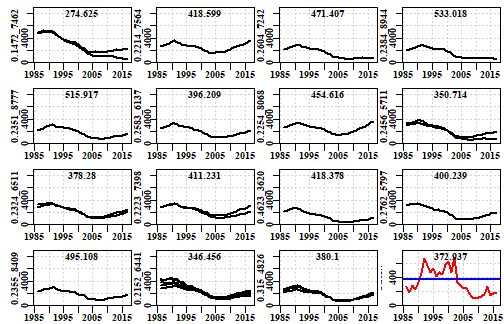

__Figure 2.__ 15 examples of different _r-K_ combinations only illustrating those trajectories that were plausible, the number at the top of each plot is the predicted MSY for the given parameter pair. The r and K values are the y-axis labels in each case. The final plot is the catch history with the predicted average MSY as the blue line.

\newline

Once the _summcMSY_ object has been generated the results can be summarized by using the _plotcMSY6_ function. This generates a plot of the combinations of _r_ and _K_ and whether they succeeded or not. In addition it displays the distribution of the successful _r_, _K_, and _MSY_ values.


```r
plotcMSY6(summcMSY,fish[,"catch"],label=glb$spsname)
```

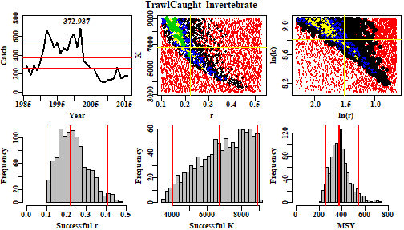

__Figure 3.__ A plot of the catch trajectory with the MSY and its 90% percentiles. The two colour plots are a plot of the _K_ vs _r_ combinations with the red dots depicting failure and then the increasing colours depicting more combinations of initial depletion that succeeded for each _r-K_ pair. The right-hand plot is the log-transformed version of the left-hand plot. The histograms describe the distributions of the successful _r-K_ pairs and the resulting MSY. The red lines are the median and the 90th percentile confidence intervals.


### Interpretation of the plotcMSY6 plot

The histograms along the bottom row of __Figure 3__ illustrate the distribution of the successful values of each parameter and the resulting MSY from the parameter pairs. Because of the truncation of the _K_ values in the two phase operation of the analysis it should not be surprising if the 'Successful K' histogram is flat up against the right hand bound. However, if either of the _r_ or left-hand side of the _K_ plots is hard up against the bounds, it would be worthwhile exploring whether different initial values of the _r_ and _K_ values are less constrained. This can be done using a different _resilience_ value or by explicitly altering the _start_r_ and the _start_K_ values. Around the jurisdictions examples were seen where parts of the _r_ or _K_ histograms were flat topped, which suggests there is insufficient information in the catches to adequately discriminate between potentially successful trajectories and failures. 

Reading Martell and Froese (2013) one can see that the method relies on the notion that a fishery is expected to begin small, build up catches, and then those catches lead to depletion so that they cannot be maintained and the catches drop. Of course, in Australia there can be many reasons for catches to drop other than the stock becoming depleted. There may be management interventions that lead to reduced catches (imposed catch limits, large marine closures, gear restrictions, and other management steps). In such situations where catches are reduced before stock depletion leads to reduced catches the catch-MSY seems likely to generate conservative estimates of sustainable production. Other issues that can arise are that catches have only ever increased or stayed stable. Without an on-going decline in catches at some period in the fishery, the model used inside the catch-MSY will have no may in which to characterize maximum productivity and it may give simply an approximate estimate of the average catches. Obviously care is needed when interpreting the outputs from the catch-MSY analysis.

The Catch-MSY method requires a catch history and some prior notion of the relative resilience or expected productivity of the species being fished. The basic idea is that the method begins with a given range of initial depletion and final depletion levels along with initial ranges of the two parameters describing the Schaefer model; these are the _r_ and _K_ parameters representing the un-restricted population growth rate and the population carrying capacity respectively. The catch-MSY method is based on a review of very many catch histories and relies on an expectation of catches increasing as a fishery develops and then decreasing as the catches impact the stock. The statistics can begin at the start of a fishery or after it has already developed, hence the initial depletion is set by comparing the initial catches with the maximum catches. The initial ranges for the model parameters depend on the assumed productivity or resilience of the species of which four options exist - "verylow", "low", "medium", and "high", with associated _r_ ranges of (0.015 - 0.125), (0.1 - 0.6), (0.3 - 0.8), and (0.6 - 1.5). In the original code associated with the Martell and Froese (2013) paper they only used three resilience categories, omitting the "medium". The initial range of the unfished biomass is also very broad with a minimum set at the maximum catch and a maximum set at 60 times the maximum catch.

In case these particular combinations do not suit what is known or suspected of a particular species, the _run_cMSY_ function now includes the option to set your own limits on both the initial values for _r_ and _K_. A call to either _formals(run_CMSY)_ or to _?run_cMSY_ will illustrate the syntax and the names of _start_r_ and _start_K_. In each case they require a short vector of two numbers (e.g. _start_r=c(0.015,0.3)_) 


### Results from the Catch-MSY Analysis

The plots above illustrate the results and provide some information but it is also helpful to obtain a tabulation of the outcome of the analysis. For that we use the _pulloutStats_ function. It generates another object containing a matrix of r, K, MSY, and current depletion percentiles and mean values. In addition, it contains the successful biomass trajectories and those same trajectories translated into depletion levels.


```r
results <- pulloutStats(answer$R1)
print(str(results))
```

```
## List of 3
##  $ output : num [1:4, 1:8] 0.118 4373.986 242.778 0.06 0.221 ...
##   ..- attr(*, "dimnames")=List of 2
##   .. ..$ : chr [1:4] "r" "K" "MSY" "CurrDepl"
##   .. ..$ : chr [1:8] "2.5%Perc" "Mean" "97.5%Perc" "2.5%" ...
##  $ traject: num [1:2472, 1:35] 4719 4870 2608 2157 2007 ...
##   ..- attr(*, "dimnames")=List of 2
##   .. ..$ : chr [1:2472] "1" "2" "3" "4" ...
##   .. ..$ : chr [1:35] "1986" "1987" "1988" "1989" ...
##  $ deplet : num [1:2472, 1:35] 0.632 0.653 0.345 0.298 0.224 ...
##   ..- attr(*, "dimnames")=List of 2
##   .. ..$ : chr [1:2472] "1" "2" "3" "4" ...
##   .. ..$ : chr [1:35] "1986" "1987" "1988" "1989" ...
## NULL
```


__Table 2.__ The results$output statistics from the Catch-MSY analysis. The 2.5Perc and 97.5Perc are the respective percentile describing the spread of the trajectories (i.e. not confidence intervals around the mean). The % columns are the quantiles so that the 50% columns represents the medians.

```
##          2.5%Perc    Mean 97.5%Perc    2.5%      5%     50%     95%   97.5%
## r            0.12    0.22      0.42    0.11    0.13    0.22    0.37    0.41
## K         4373.99 6741.92  10391.79 4030.95 4344.37 7082.61 8833.71 8916.22
## MSY        242.78  372.94    572.87  243.63  259.76  375.36  543.15  585.27
## CurrDepl     0.06    0.31      0.56    0.07    0.09    0.33    0.49    0.49
```


These results are fine as far as they go but in order to obtain some notion of stock status it is necessary to trace the successful trajectories in terms of how their depletion has changed through time. For this we can use the same _plottrajectory_ function as used previously only this time changing the _oneplot_ parameter to TRUE, which overrides the plotall parameter. The Bmax parameter can be adjusted to obtain an acceptable spread of the results.


```r
out <- plottrajectory(answer$R1,fish$year,fish$catch,answer$parbound,
                      oneplot=TRUE,scalar=1.0,plotout=TRUE,plotall=7)
```

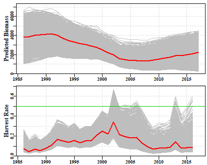

__Figure 4.__ The top plot is of the successful biomass trajectories and the red line is the mean in each year. The bottom plot is of the annual harvest rate; note a few seemingly successful trajectories lead to harvest rates > 0.5. Associated with these high harvest rates note also that the final biomass for many trajectories is very low, which may also be deemed unrealistic.


Given each biomass trajectory has an associated _K_ value it is possible to translate the biomass trajectories into depletion trajectories. There are two ways to do this, the simplest way is to use the _pulloutStats_ function (see example above) which outputs both the biomass and depletion matrices as a byproduct to estimating the mean MSY and current depletion.


```r
results <- pulloutStats(answer$R1)
# Note the use of constC=0, we are not doing any projections yet so no constant catches
effectC <- plotconstC(results$deplet,endyear=2017,constC=0,limit=0.2,target=0.4,
                      console=TRUE,intensity=NA,contours=TRUE) 
```

```
##      Year   PltLim%   PgtTarg%      Mean    Median Pincrease
## 2013 2013 0.2742718 0.07119741 0.2670494 0.2691291 0.2245146
## 2014 2014 0.2884304 0.08656958 0.2662521 0.2715266 0.1654531
## 2015 2015 0.2617314 0.16019417 0.2827276 0.2910247 0.1986246
## 2016 2016 0.2463592 0.24555016 0.2969281 0.3088668 0.2419094
## 2017 2017 0.2362460 0.32038835 0.3104099 0.3261097 0.0000000
```

```r
abline(h=c(0.2,0.3,0.4),col=3,lwd=2)
```

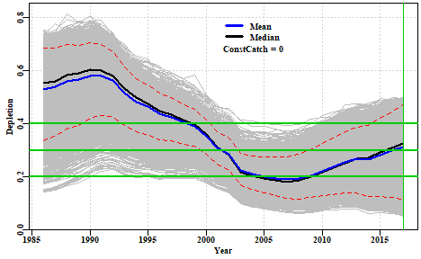

__Figure 5.__ A plot of the successful depletion trajectories with the mean and median annual depletion marked. The lower red line is the default 0.2B0 limit reference point, while the upper is the input target reference point. The green line denotes the end of the final year in which data are available. If the abbreviated table under the plot is not wanted (all the information will be in _effectC_) then the _console=TRUE_ should be set to _console=FALSE_. The red dashed lines are the inner 80th and 90th percentile bounds but if not wanted set _contours=FALSE_.


The PltLim% column in the console output is the proportion of trajectories that are < _limit_, whereas the PgtTarg% is the proportion of trajectories that are greater than the target. Given the great uncertainty in these analyses it should not be surprising that both of these increase, which suggests the total spread of the outcomes is increasing. The question that needs answering is whether the average is increasing or decreasing here both the mean and median are increasing though only about 4 - 5 % across the five years prior to the final year of data. As the average stock size increases the rate of increase would be expected to first increase and then decline as the stock moved on average above the biomass that produces the maximum productivity (_B~MSY~_).

The default plot of the depletion in __Figure 5__ has grey lines of equal density but if one wants to attempt to generate a plot with the density of colour matched to the density of trajectories then it is possible to include a number in the _intensity_ parameter. The value input determines the density of the trajectories required to obtain full colour intensity and this will undoubtedly vary by fishery and so will need to be used interactively to find a value that generates a satisfactory plot. If the plot is to be printed then be sure to save the plot as a bit map or .png file so that the varying density and transparency is retained in the plot. 


```r
effectC <- plotconstC(results$deplet,endyear=2017,constC=0,limit=0.2,target=0.4,
                      console=FALSE,intensity=30) 
abline(h=c(0.2,0.3,0.4),col=3,lwd=2)
```

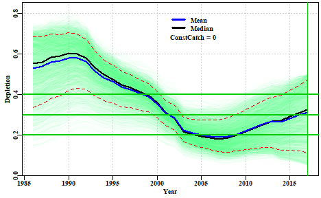

__Figure 6.__ A plot of the successful depletion trajectories with the mean and median annual depletion marked with the density of trajectories represented by different intensity of colour. The lower red line is the default 0.2B0 limit reference point, while the upper is the input target reference point. The green line denotes the end of the final year in which data are available. The intensity value may need to be adjusted empirically to obtain a satisfactory plot.

In __Figure 6__ different intensity of colours are used to denote the paths followed by most trajectories. In this case between 1995 - about 2001 most lines are towards the top of the overall path but are moving downwards until between 2002 - 2008 the median line is biased low with it being closer to the bottom of all paths than the top. After that most paths are moving upwards with the median once again shifting closer to the upper margin than the lower. 

### Constant Catch Projections

From the table and the plot it is clear that the average depletion is quite a way below the selected target. We need to remember that this is a data-poor assessment and that currently there are no agreed harvest strategies or harvest control rules. Nevertheless, if we project the currently potentially successful trajectories forward under different constant catch scenarios we will be able to determine what levels of catch will lead to the stock increasing (on average) and what will lead to decreases (on average). Depending on where the assessment indicates a species is laying will then determine what management action to advise to manage a stock in a desired direction (whether that be to increase or decrease its current state). 


```r
output <- doconstC(answer$R1,projn=10,constCatch=250,lastyear=2017,limit=0.2,
                   target=0.48)
```

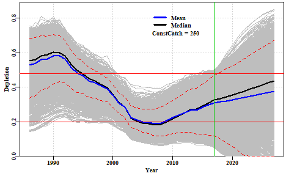

```
##      Year   PltLim%   PgtTarg%      Mean    Median Pincrease
## 2017 2017 0.2362460 0.06553398 0.3104099 0.3261097  0.000000
## 2018 2018 0.2402913 0.12135922 0.3156529 0.3346428  0.663835
## 2019 2019 0.2455502 0.17556634 0.3208321 0.3445134  0.663835
## 2020 2020 0.2487864 0.22936893 0.3264415 0.3536209  0.663835
## 2021 2021 0.2556634 0.27224919 0.3327283 0.3643303  0.663835
## 2022 2022 0.2605178 0.30380259 0.3396614 0.3773421  0.663835
## 2023 2023 0.2669903 0.33859223 0.3470102 0.3887184  0.663835
## 2024 2024 0.2726537 0.36771845 0.3543857 0.4008196  0.663835
## 2025 2025 0.2771036 0.39199029 0.3618398 0.4131438  0.663835
## 2026 2026 0.2807443 0.42192557 0.3693940 0.4240156  0.663835
## 2027 2027 0.2847896 0.44377023 0.3768815 0.4372693  0.663835
##      Year      PltLim%    PgtTarg%      Mean    Median Pincrease
## 1986 1986 0.0125404531 0.670711974 0.5300405 0.5531796 0.8685275
## 1987 1987 0.0076860841 0.692961165 0.5376283 0.5605029 0.8838997
## 1988 1988 0.0040453074 0.747572816 0.5586722 0.5825733 0.9122168
## 1989 1989 0.0032362460 0.768608414 0.5653527 0.5898435 0.9292071
## 1990 1990 0.0000000000 0.809870550 0.5798992 0.6018966 0.9421521
## 1991 1991 0.0000000000 0.826456311 0.5805866 0.5998561 0.9506472
## 1992 1992 0.0000000000 0.806229773 0.5625152 0.5802359 0.9466019
## 1993 1993 0.0000000000 0.702265372 0.5153674 0.5312971 0.9186893
## 1994 1994 0.0004045307 0.591019417 0.4829531 0.4974120 0.8859223
## 1995 1995 0.0000000000 0.480582524 0.4635858 0.4762857 0.8652913
## 1996 1996 0.0016181230 0.289644013 0.4370907 0.4489793 0.8220065
## 1997 1997 0.0008090615 0.188915858 0.4253478 0.4354660 0.8017799
## 1998 1998 0.0020226537 0.074838188 0.4062880 0.4150261 0.7431230
## 1999 1999 0.0020226537 0.030339806 0.3900184 0.3971485 0.6941748
## 2000 2000 0.0056634304 0.005258900 0.3539548 0.3592447 0.5934466
## 2001 2001 0.0210355987 0.000000000 0.3097139 0.3110503 0.4692557
## 2002 2002 0.0449029126 0.000000000 0.2833666 0.2825209 0.3960356
## 2003 2003 0.3171521036 0.000000000 0.2242482 0.2185314 0.2483819
## 2004 2004 0.4789644013 0.000000000 0.2095855 0.2032059 0.2103560
## 2005 2005 0.5558252427 0.000000000 0.1998565 0.1927549 0.1848706
## 2006 2006 0.5869741100 0.000000000 0.1944513 0.1866191 0.1605987
## 2007 2007 0.6096278317 0.000000000 0.1886733 0.1809008 0.1379450
## 2008 2008 0.5748381877 0.000000000 0.1932646 0.1852489 0.1306634
## 2009 2009 0.5084951456 0.000000000 0.2051318 0.1986627 0.1371359
## 2010 2010 0.4243527508 0.000000000 0.2219994 0.2176179 0.1577670
## 2011 2011 0.3527508091 0.000000000 0.2371569 0.2341032 0.1800162
## 2012 2012 0.3021844660 0.000000000 0.2531577 0.2526267 0.2050971
## 2013 2013 0.2742718447 0.000000000 0.2670494 0.2691291 0.2245146
## 2014 2014 0.2884304207 0.000000000 0.2662521 0.2715266 0.1654531
## 2015 2015 0.2617313916 0.002022654 0.2827276 0.2910247 0.1986246
## 2016 2016 0.2463592233 0.014967638 0.2969281 0.3088668 0.2419094
## 2017 2017 0.2362459547 0.065533981 0.3104099 0.3261097 0.0000000
## 2018 2018 0.2402912621 0.121359223 0.3156529 0.3346428 0.6638350
## 2019 2019 0.2455501618 0.175566343 0.3208321 0.3445134 0.6638350
## 2020 2020 0.2487864078 0.229368932 0.3264415 0.3536209 0.6638350
## 2021 2021 0.2556634304 0.272249191 0.3327283 0.3643303 0.6638350
## 2022 2022 0.2605177994 0.303802589 0.3396614 0.3773421 0.6638350
## 2023 2023 0.2669902913 0.338592233 0.3470102 0.3887184 0.6638350
## 2024 2024 0.2726537217 0.367718447 0.3543857 0.4008196 0.6638350
## 2025 2025 0.2771035599 0.391990291 0.3618398 0.4131438 0.6638350
## 2026 2026 0.2807443366 0.421925566 0.3693940 0.4240156 0.6638350
## 2027 2027 0.2847896440 0.443770227 0.3768815 0.4372693 0.6638350
```

__Figure 7.__ A plot of the successful depletion trajectories followed by five years of projection. The limit and target reference points are depicted by the two fine red lines. The green line denotes the end of the final year in which data are available, with projections to the right. The mean depletion varies away from the median because an array of trajectories go extinct on projection


The projections suggest that a total catch of about 250 t would be expected to lead, on average, a small increase in stock levels over the five years. By exploring the outcomes with smaller and larger constant catches the implications can be made clear and appropriate decisions about catch levels or triggers could then be made in an attempt to meet whatever objective is desired for the fishery. What seems to be implied by __Figure 7__ is that the stock in question was over-fished between about 2003 - 2010 but as the plot of catches vs MSY from the plotcMSY6 analysis illustrate, after 2003 catches were reduced significantly and that led to the stock rebuilding until in 2017 it was estimated (with great uncertainty) to be about 30%B0. In 2017, given the stock is rebuilding and is already above the limit reference point it can be claimed that it is sustainable and that over-fishing is not occurring.


### Robustness of MSY Estimate

While it is true that the ranges of the successful _r_ and _K_ combinations is quite wide, because there is a strong negative correlation between these two parameters the spread of the MSY estimates is not so large in relative terms. This can be illustrated by using the _trendMSY_ function which estimates the MSY implied by a series of slices down the K axis from the scatter of r - K combinations. Given that MSY is estimated from the r - K combinations it is possible to map the estimated MSY onto the plot of r - K combinations, along with the estimated trend from the successful r - K combinations (_Figure 6_).


```r
r <- summcMSY$r
K <- summcMSY$K
meanmsy <- trendMSY(summcMSY$r,summcMSY$K,inc=300)
centr <- central(r)
centK <- central(K)
means <- central(summcMSY$msy)
avMSY <- means["Geometric","Mean"]
# plotprep(width=7,height=4.0)
par(mfrow=c(1,1),mai=c(0.45,0.45,0.05,0.05),oma=c(0.0,0,0.0,0.0)) 
par(cex=0.85, mgp=c(1.35,0.35,0), font.axis=7,font=7,font.lab=7)
plot(r,K,type="p",pch=16,col=rgb(1,0,0,1/3),panel.first=grid())
rval <- seq(0.1,0.6,length=100)
kval <- (4 * avMSY)/rval  # calculate the K value that would generate avMSY
lines(rval,kval,col=4,lwd=2)
pickvalid <- which(meanmsy[,"N"] > 0)
lines(meanmsy[pickvalid,"rcenter"],meanmsy[pickvalid,"Kcenter"],lwd=2,col=3)
points(centr[2,1],centK[2,1],pch=16,cex=2,col=1)
```

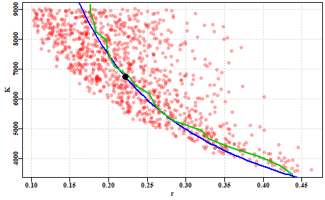

__Figure 8.__ A plot of the successful r - K combinations with the estimated mean MSY over-plotted in blue and the mean MSY for horizontal slices of the cloud of successful r - K combinations derived from _trendMSY_. Note that the overall mean MSY (the black dot) coincides approximately with the point at which the blue and the green lines begin to diverge. 


One can imagine contours of MSY running across the r - K parameter space and the catch-MSY analysis is discovering which r - K combinations are consistent with the possibilities (_Figure 7_).


```r
r <- summcMSY$r
K <- summcMSY$K
avMSY <- seq(100,600,100)  
nMSY <- length(avMSY)
# plotprep(width=7,height=4.0)
par(mfrow=c(1,1),mai=c(0.45,0.45,0.05,0.05),oma=c(0.0,0,0.0,0.0)) 
par(cex=0.85, mgp=c(1.35,0.35,0), font.axis=7,font=7,font.lab=7)
plot(r,K,type="p",pch=16,col=rgb(1,0,0,1/3),panel.first=grid(),ylim=c(2500,9000))
rval <- seq(0.1,0.6,length=100)
for (i in 1:nMSY) {
   kval <- (4 * avMSY[i])/rval  # calculate the K value that would generate avMSY
   lines(rval,kval,col=4,lwd=2)
}
x <- seq(0.15,0.375,length=nMSY)
yval <- 4 * (avMSY/x)
for (i in 1:nMSY) text(x[i],yval[i],avMSY[i],cex=1,font=7,pos=4)
```

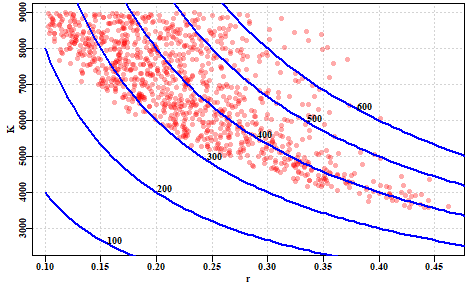

__Figure 9.__ A plot of the successful r - K combinations with an array of implied MSY values as implied contours across the r - K parameter space. Some contours would under-estimate the implied productivity while others would over-estimate what was consistent with available observations.


## Significant Unknown Recreational Catches 

It is often the case that obtaining accurate estimates of recreational catch is rarely done even when it is known that they can rival commercial catches. In States where there are significant recreational catches of commercial species there remains a need to assess the stock status of such species and likely also provide management advice as to what would constitute sustainable commercial catches. As long as there is some notion of the proportion of recreational catches it is still possible to apply the catch-MSY assessment method to a time-series of commercial catches. To demonstrate the effect of having significant amounts of recreational catch on top of a commercial catch we can conduct an analysis using one of the data sets internal to __datalowSA__, then that can be compared to the same analysis after the catches have been proportionally reduced in some manner as if the total catch was made up of known commercial catches and unknown recreational catches. In this preliminary exploration we will examine a deterministic reduction keeping just 80%, and 60% of known commercial catches while repeating the analysis. To include some variation we can reduce the original catches by a randomly varying proportion around some selected mean, finally we can conduct the analysis on a deterministically reducing commercial proportion down from say 80% to 50% over the time period of data available.

We can use the _invert_ data set. First we obtain the expected outcome by analyzing the full data set.


```r
library(datalowSA)
data(invert)
fish <- invert$fish
glb <- invert$glb

reps <- 5000  # one would run at least 20000, preferably more
answer <- run_cMSY(fish,glb,n=reps,sigpR=0.025)
summcMSY <- summarycMSY(answer,fish,final=TRUE)
ans <- pulloutStats(answer$R1)
round(ans$output[,1:3],3)
```

```
##          2.5%Perc     Mean 97.5%Perc
## r           0.126    0.228     0.413
## K        4377.463 6435.464  9461.004
## MSY       250.802  367.407   538.225
## CurrDepl    0.048    0.301     0.555
```

So the mean current depletion is estimated to be about 0.31, with an MSY of about 370 tonnes. Now we can answer what would happen if the catch data was only 80% of the original (with variation about that 80% each year; this implies there would be unknown recreational catches of about 20% plus or minus some variable amount each year) while the cpue data remains unchanged. The deterministic reductions gave very precise results so this exposition begins with the somewhat more realistic variation around a given average proportion of recreational catches


```r
commprop <- 0.8
propcom <- rnorm(31,mean=commprop,sd=0.025) # 31 equals the number of years
fishC <- fish
fishC[,"catch"] <- fishC[,"catch"]*propcom
answerC <- run_cMSY(fishC,glb,n=5000,sigpR=0.025)
ansC <- pulloutStats(answerC$R1)
#str(ans10)
round(ansC$output[,1:3],3)
```

```
##          2.5%Perc     Mean 97.5%Perc
## r           0.129    0.232     0.417
## K        3449.102 5182.288  7786.406
## MSY       206.364  300.360   437.168
## CurrDepl    0.059    0.313     0.567
```

```r
round(ans$output[,1:3],3)
```

```
##          2.5%Perc     Mean 97.5%Perc
## r           0.126    0.228     0.413
## K        4377.463 6435.464  9461.004
## MSY       250.802  367.407   538.225
## CurrDepl    0.048    0.301     0.555
```

```r
msy <- ansC$output["MSY","Mean"]/ans$output["MSY","Mean"]
depl <- ansC$output["CurrDepl","Mean"]/ans$output["CurrDepl","Mean"]
cat("reduced catch MSY/full catch MSY = ", msy, mean(propcom),"\n")
```

```
## reduced catch MSY/full catch MSY =  0.8175124 0.8025488
```

```r
cat("Proportion of Current Depetion = ",depl,"\n")
```

```
## Proportion of Current Depetion =  1.038286
```

You could try different values for the _commprop_ value to see the effect of the recreational proportion increasing. But it appears that the impact of a 20% decrease in known catches is to reduce the sustainable production available to commercial operators by about 20% (and similarly a 40% reduction leads to about a 40% reduction in production).

If instead of the mean recreational proportion staying approximately stable through time it is also possible to examine the effect of a trend in the proportion of commercial catches. Here we inspect the effect of the commercial proportion changing from 80% to 50% (unknown recreational catches change from 20% to 50%) over a 31 year period. Normally one would use at least 20000 replicates rather than 5000.


```r
propcom <- seq(0.8,0.5,length=31) # 31 equals the number of years
fishC <- fish
fishC[,"catch"] <- fishC[,"catch"]*propcom
answerC <- run_cMSY(fishC,glb,n=5000,sigpR=0.025)
ansC <- pulloutStats(answerC$R1)
round(ansC$output[,1:3],3)
```

```
##          2.5%Perc     Mean 97.5%Perc
## r           0.125    0.222     0.395
## K        3133.529 4572.503  6672.280
## MSY       172.330  253.832   373.881
## CurrDepl    0.061    0.313     0.566
```

```r
round(ans$output[,1:3],3)
```

```
##          2.5%Perc     Mean 97.5%Perc
## r           0.126    0.228     0.413
## K        4377.463 6435.464  9461.004
## MSY       250.802  367.407   538.225
## CurrDepl    0.048    0.301     0.555
```

```r
msy <- ansC$output["MSY","Mean"]/ans$output["MSY","Mean"]
depl <- ansC$output["CurrDepl","Mean"]/ans$output["CurrDepl","Mean"]
cat("reduced catch MSY/full catch MSY = ", msy, mean(propcom),"\n")
```

```
## reduced catch MSY/full catch MSY =  0.690875 0.65
```

```r
cat("Proportion of Current Depletion = ",depl,"\n")
```

```
## Proportion of Current Depletion =  1.039248
```


If this code chunk is run numerous times the outcomes suggest that the estimate of sustainable commercial catch may be biased slightly high but, on the other hand the depletion level is invariably very close to that obtained when using all the catch data. 

These two sets of scenarios suggest that if we consider an unknown recreational catch to reflect one of these two scenarios (randomly varying around some relatively constant proportion of the commercial catch or approximately following some trajectory from one proportion to a higher proportion of recreational catch) then it should still be possible to get an estimate of the stock's current depletion level while, at the same time generating potential management advice concerning the commercial fishery. These explorations need to be more fully investigated but, at least with the Catch-MSY approach, the conclusions appear to be acceptable. It can even provide a phase plot of predicted biomass against harvest rate, but obviously only for the commercial component. These results are consistent with those of
Rudd and Branch (2017) who find very similar results using fitted stock assessments in a management strategy evaluation framework rather than catch-only methods.


```r
cMSYphaseplot(answerC,fishC)
```

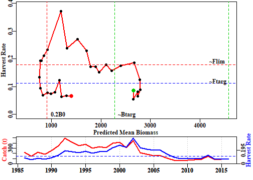

which can then be compared with the analysis that derived from the full data-set of catches:


```r
cMSYphaseplot(answer,fish)
```

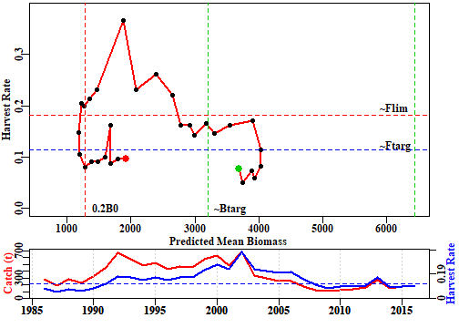

There are clear differences in that the analysis of partial catch suggests that there was a time that the stock went below the limit reference point but overall, the trajectory obtained is approximately the same as that for the full catch data set.

It is not surprising that differences occur between those analyses that capture all catches and those that include a proportion of unknown catches because the productivity now appears to be different. Nevertheless, the same general pattern observed with all data remains, even with the truncated data. In reality, with a fishery having a significant recreational proportion, we would only have the 'truncated' data but these explorations indicate that it should still be possible to obtain both a status and management advice (at least for the commercial proportion of the fishery) under the assumption that the relative proportion would not change further. Of course, if there is a trend in the proportion of recreational take relative to the commercial take, then only advice in the short term could be deemed useful.


## Plausible Levels of Harvest Rate

Even though the overall productivity of the diverse Australian fisheries may be relatively high, the productivity of many individual Australian fisheries tends not to be as great as equivalent fisheries in the northern hemisphere. Many commercial Australian fish species seem to live longer than northern hemisphere equivalents and live less densely on the sea bed, and hence naturally cannot be as productive. It seems unlikely, therefore, that the fishing mortalities observed in places such as the North Sea, where _F_ values of 1.0 (equivalent to harvest rates of between 0.6 and 0.7 each year) have been common, are not plausible and certainly not sustainable here. The catch-MSY method only uses the available time-series of catches and its random selection of _r-K_ combinations can select highly productive combinations which enable the stock to grow well beyond plausible bounds (rejected), there are other combinations whose implied productivity (from the Schaefer model used within the catch-MSY to reflect the stock dynamics) is far too low so that any trajectories go extinct (rejected). Then there are the combinations that imply a productivity that allows for the catches taken but stays within the other constraints implied by the resilience and starting catch levels for the species (accepted trajectories). However, within those accepted trajectories there will be some having implied productivities that only barely survive within the constraints. It is also implied that some of these trajectories reflect relatively high annual harvest rates. For example, using the _invert_ data set we can obtain some trajectories with harvest rates greater than 0.5 (50% of exploitable biomass taken every year).


```r
# library(datalowSA)
data(invert)
fish <- invert$fish
glb <- invert$glb 
# normally one would run 20000+ replicates, but for speed here we use 5000
answer <- run_cMSY(fish,glb,n=5000,sigpR=0.025,finaldepl=c(0.05,0.5),maximumH=1.0)
ans <- pulloutStats(answer$R1)
round(ans$output[,1:3],3)
```

```
##          2.5%Perc     Mean 97.5%Perc
## r           0.124    0.225     0.411
## K        4311.360 6521.523  9864.696
## MSY       250.053  367.223   539.296
## CurrDepl    0.055    0.311     0.566
```

```r
out <- plottrajectory(answer$R1,fish$year,fish$catch,answer$parbound,
                      oneplot=TRUE,scalar=1.0,plotout=TRUE,plotall=7)
```

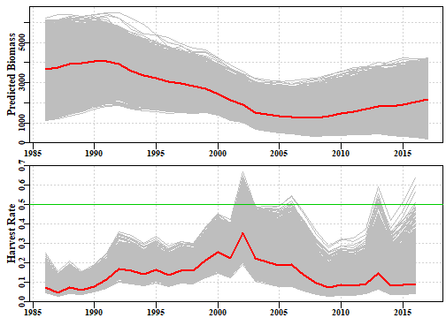

__Figure 10.__ A plot of the implied successful biomass trajectories and their implied annual harvest rates generated by the function _plottrajectory_ with the option _oneplot_ set to _TRUE_. The red lines are the median values, the green line is at a harvest rate of 0.5, for reference. 

In __Figure 10.__ some of the harvest rates in the final years approach 0.5 but between 2000 and about 2007 some trajectories fully breach the 0.5 line and often stay close to it. Part of this reflects the default final depletion range of c(0.05,0.5) given if catches in the final year are less than half the maximum catch (a selection which ignores the fact that management intervention or marketing issues may have controlled catches rather than an inability to catch). However, even if we change the lower final depletion value to, for example, 0.15, while that reduces most of the final year high harvest rates that survive, the period from 2000 still appears to be exceptional.

In order to conduct a sensitivity on the implications of there being an upper limit of harvest rate a new _maximumH_ parameter has been added to the _run_cMSY_ function. Its default value is set to 1.0, so that all harvest rates are possible (obviously one could not take more than 100% of what is present!). If we alter that value to 0.5 the outcome changes.


```r
# library(datalowSA)
# normally one would run 20000+ replicates, but for speed we use 5000
answer <- run_cMSY(fish,glb,n=5000,sigpR=0.025,finaldepl=c(0.05,0.5),maximumH=0.5)
ans <- pulloutStats(answer$R1)
round(ans$output[,1:3],3)
```

```
##          2.5%Perc     Mean 97.5%Perc
## r           0.129    0.187     0.270
## K        5859.430 7140.591  8701.877
## MSY       244.812  333.449   454.178
## CurrDepl    0.097    0.335     0.573
```

```r
out <- plottrajectory(answer$R1,fish$year,fish$catch,answer$parbound,
                      oneplot=TRUE,scalar=1.0,plotout=TRUE,plotall=7)
```

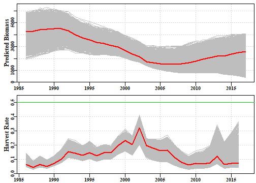

__Figure 11.__ A plot of the implied successful biomass trajectories and their implied annual harvest rates generated by the function _plottrajectory_ with the option _oneplot_ set to _TRUE_ and the _maximumH_ parameter set to 0.5. The red lines are the median values, the green line is at a harvest rate of 0.5, for reference.


With this extra constraint the successful biomass trajectories are much more restricted and the harvest rates far lower. This change only improves the depletion level by about 3%, but the productivity, as measured by the MSY is reduced from about 370 t down to 333 t, a reduction of 10%. It may appear counter-intuitive that removing some of the lower trajectories (note the increase in the lower 95th percentile) led to a lower productivity, but the important parts are reflected in the mean values of _r_, the population growth rate. By comparing the outputs related to __Figures 10 and 11__ the reduction in _r_ should be clear. It is this reduction that has led to the decrease in productivity. 

Such a sensitivity on this parameter (_maximumH_) is very dependent upon local knowledge of the history of any fishery. Productivity is also partly determined by the resilience attributed to a species. One could also run sensitivities on what resilience was given to a species. The importance of that is that the resilience determines the implied bounds on _r_ used in the search for successful trajectories. Of course, it is now possible to modify these if it is felt necessary by directly entering values for _start_r_ as a vector of two numbers.

### Other Sensitivities

We have seen it is possible to examine the implications of changing the _initdepl_ and _finaldepl_, along with changing the _start_r_ and _start_K_. A further sensitivity that ought to be conducted relates to the process error term _sigpR_. This term aims to attempt to capture un-accounted for variation in the stock dynamics between the years. The simple model is so simple it fails to capture many sources of natural variation. It is worthwhile examining alternative values for _sigpR_. In particular, it is worthwhile effectively turning this source of variation off to see the effect of almost deterministic dynamics. This can be achieved by setting _sigpR = 0_.


```r
# library(datalowSA)
# normally one would run 20000+ replicates, but for speed we use 5000
answer <- run_cMSY(fish,glb,n=5000,sigpR=0,finaldepl=c(0.05,0.5),maximumH=1.0)
ans <- pulloutStats(answer$R1)
round(ans$output[,1:3],3)
```

```
##          2.5%Perc     Mean 97.5%Perc
## r           0.118    0.216     0.396
## K        4488.405 6983.148 10864.517
## MSY       257.001  377.894   555.655
## CurrDepl    0.057    0.312     0.567
```

```r
out <- plotconstC(ans$deplet,endyear=2017,constC=0)
```

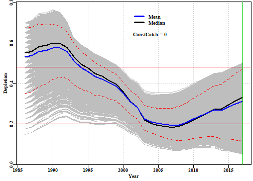

```
##      Year   PltLim%    PgtTarg%      Mean    Median Pincrease
## 2013 2013 0.2700535 0.000000000 0.2696135 0.2734783 0.2100840
## 2014 2014 0.2872422 0.000000000 0.2688759 0.2751529 0.1562261
## 2015 2015 0.2635600 0.000000000 0.2849852 0.2958518 0.1776165
## 2016 2016 0.2448434 0.009167303 0.2988165 0.3151090 0.1875477
## 2017 2017 0.2372040 0.077922078 0.3117663 0.3318457 0.0000000
```

__Figure 12.__ A plot of the implied successful depletion trajectories when the _sigpR_ parameter is set to 0. The 23 different starting depletion levels between the default 0.15 - 0.7 can now be clearly seen. The lowest values are the most sparse in terms of successful trajectories.

The assumption that a final depletion level of 5% (0.05) is plausible should be questioned for many Australian fisheries when the catches remain about 1/3 of the maximum and the CPUE barely changes. As always, such data-poor stock assessments should only form part of a weight-of-evidence argument supporting a claim for a set of management advice and stock status determinations.


```r
plotfish(fish,glb)
```

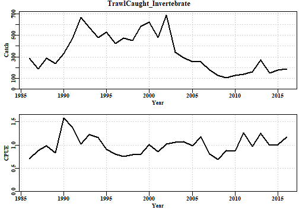

__Figure 13.__ A plot of the reported catch history and the standardized CPUE for the example data set used in the vignette.


## References

Dick, E.J. and A.D. MacCall (2011) Depletion-based stock reduction analysis: a catch-based method for determining sustainable yields for data-poor fish stocks. _Fisheries Research_ __110__(2): 331-341

Haddon, M. (2014) Tier 4 analyses in the SESSF, including deep water species. Data from 1986 – 2012. Pp 352 – 461 in Tuck, G.N. (ed) (2014) _Stock Assessment for the Southern and Eastern Scalefish and Shark Fishery 2013. Part 2._ Australian Fisheries Management Authority and CSIRO Marine and Atmospheric Research, Hobart. 313p.

Haddon, M., Klaer, N., Wayte, S., and G. Tuck (2015) _Options for Tier 5 approaches in the SESSF and identification of when data support for harvest strategies are inappro-priate._ CSIRO. FRDC Final Report 2013/200. Hobart. 115p.

Kimura, D.K. and J.V. Tagart (1982) Stock Reduction Analysis, another solution to the catch equations. _Canadian Journal of Fisheries and Aquatic Sciences_ __39__: 1467 - 1472.

Kimura, D.K., Balsiger, J.W., and Ito, D.H. 1984. Generalized stock reduction analysis. _Canadian Journal of Fisheries and Aquatic Sciences_ __41__: 1325–1333.

Little, L.R., Wayte, S.E., Tuck, G.N., Smith, A.D.M., Klaer, N., Haddon, M., Punt, A.E., Thomson, R., Day, J. and M. Fuller (2011) Development and evaluation of a cpue-based harvest control rule for the southern and eastern scalefish and shark fishery of Australia. _ICES Journal of Marine Science_ __68__(8): 1699-1705.

Martell, S. and R. Froese (2013) A simple method for estimating MSY from catch and resilience. _Fish and Fisheries_ __14__: 504-514

Punt, A.E., Butterworth, D.S. and A.J. Penney (1995) Stock assessment and risk analysis for the South Atlantic population of albacore _Thunnus alalunga_ using an age-structured production model _South African Journal of Marine Science_ __16__: 287-310. http://dx.doi.org/10.2989/025776195784156476

R Core Team (2017). _R: A language and environment for statistical computing._ R Foundation for Statistical Computing, Vienna, Austria. URL https://www.R-project.org/. see also https://cran.r-project.org/

RStudio (2016)  www.rstudio.com

Rudd, M.B. and T.A. Branch (2017) Does unreported catch lead to over-fishing? _Fish and Fisheries_ __18__: 313-323.

Schaefer, M.B. (1954) Some aspects of the dynamics of populations important to the management of the commercial marine fisheries. _Bulletin, Inter-American Tropical Tuna Commission_, __1__: 25-56. 

Schaefer, M.B. (1957) A study of the dynamics of the fishery for yellowfin tuna in the Eastern Tropical Pacific Ocean. _Bulletin, Inter-American Tropical Tuna Commission_, __2__: 247-285

Walters, C.J., Martell, S.J.D. and J. Korman (2006) A stochastic approach to stock reduction analysis. _Canadian Journal of Fisheries and Aquatic Sciences_ __63__: 212 - 223.


=======
---
title: "Catch-MSY"
author: "Malcolm Haddon"
date: "2019-05-21"
output: rmarkdown::html_vignette
vignette: >
  %\VignetteIndexEntry{"Using Catch-MSY"}
  %\VignetteEngine{knitr::knitr}
  %\VignetteEncoding{UTF-8}
---


## Introduction

### Which Stock Assessment?

Which stock assessment method to apply to fisheries for data-poor to data-moderate species will depend upon what fisheries and biological data are available but also, importantly, on what management objectives need to be met within the jurisdiction in question. It may be the case that the fishery for a particular species is of sufficient size and value to warrant on-going monitoring and management towards some defined goal for the stock. In such a case the assessment used should obviously be capable of generating some notion of the current state of the fishery and indicate what management actions may be required to eventually achieve the agreed management goals. But some fisheries may be so minor that trying to actively manage them would be inefficient both practically and economically. Nevertheless, to meet the requirements of the Status of key Australian Fish Stocks (SAFS) one still requires some form of defensible stock assessment capable of determining whether the current level of fishing is sustainable.     

## Modified Catch-MSY

The Catch-MSY method (Martell and Froese, 2013) could be termed a 'model-assisted' stock assessment method. It only requires a time-series of catches and a set of strong assumptions to conduct a stock assessment. As only a brief description of how it is considered to work is given here, it is recommended that users read the original paper to gain an understanding of what the method does and how it does it. 

The underlying stock dynamics are described by the simple model used, which in the case implemented here is a Schaefer surplus production model with parameters _r_, the population growth rate, and _K_, the population carrying capacity or unfished biomass. The model uses ratios of the initial and final catches relative to the maximum catch to set up arrays of potential values for the initial and final depletion levels as well as for the potential range of _r_ and _K_ values (all of which are now modifiable by the user). The method sequentially steps through the years of the fishery by randomly selecting pairs of _r-K_ values from the wide initial ranges, which defines the initial biomass, subtracting the catches, and moving the population dynamics forward each year using the predictions from the simple model. Essentially this is a stock reduction that removes catches from a known set of dynamics. However, the very many _r-K_ pairs used (at least 20000) are combined with a fixed set of initial depletion levels (about 20 steps between the minimum and maximum initial depletion set) to generate often 100,000s of possible stock reduction trajectories. Criteria are included (e.g. no trajectory is kept if it predicted zero biomass or biomass above _K_) that lead to numerous potential trajectories being rejected. Those that are left after all criteria for acceptance have been completed constitute the set of trajectories deemed to be consistent with the known catches. The implications of these successful trajectories are used to produce an assessment of the possible status of the stock.

In this section we will describe how to conduct a catch-MSY analysis, how to extract the results from that analysis, as well as plot out illustrations of those results. In addition, we will examine how to project the successful trajectories under constant catch scenarios to determine what level of catches should lead to the majority of trajectories moving in a desired direction (rebuilding to a target, staying stable, or declining to a target depletion).

A standard workflow might consist of:

1. read in data and use __checkdata__ to determine which analyses are possible
2. set the run-time parameters to conduct the desired catch-MSY analysis (see later)
3. use __run_cMSY__ to conduct a catch-MSY analysis. One sensitivity you should run is to set sigpR (the proxy for process error) to 1e-10 (a very small number) to see deterministic trajectories. Do other sensitivities. 
4. use __cMSYphaseplot__ to determine status for SAFS, if more is wanted:
5. use __summarycMSY__ to generate a summary object of the answer.
6. use __plottrajectory__ to illustrate either all successful trajectories along
with the successful harvest rates (use option _oneplot = TRUE_), or just a sample of 7 or 15 biomass trajectories.
7. use  __plotcMSY6__ to plot up the overview of successful and failed r - K combinations.
8. use __pulloutStats__ to obtain summary statistics regarding MSY and depletion
9. use __plotconstC__ with $deplet  from the object output from _pulloutstats_ to plot up the successful trajectories depicting stock depletion.
10. use __doconstC__  to conduct constant catch projections to find a level of catch that lead, on average, to the population decreasing, staying stable, or increasing (possibly to some selected target within a particular time).
11. optionally, use __trendMSY__ to illustrate the relationship between the estimated MSY and the average MSY of the successful trajectories.


## Some Formal Details

The Catch-MSY method described here can be regarded as a model-assisted data-poor method. It uses a form of stock reduction analysis where the productivity of a given stock (its unfished biomass and its reproductive rate) is characterized within the parameters of a simple mathematical model, and how that modelled stock responds to the history of known catches (a stock reduction analysis) forms the basis of the alternative methods used to characterize productivity in management useable terms.

The Catch-MSY method (Martell and Froese, 2013) uses the relatively simple Schaefer surplus production model as the basis for describing the dynamics of the stock being described. 

$${B}_{t+1}={B}_{t}+r{B}_{t}\left( 1-\frac{{B}_{t}}{K} \right)-{{C}_{t}}$$
where _B~t~_ represents the stock biomass in year _t_, _r_ represents a population growth rate that includes the balance between recruitment and natural mortality, _K_ is the maximum population size (the carrying capacity), and _C~t~_ being the catch in year _t_. The $\left( 1-\frac{{B}_{t}}{K} \right)$ represents a density dependent term that trends linearly to zero as _B~t~_ tends towards _K_.

Importantly, for our purposes, one of the properties of the discrete Schaefer surplus production model is that MSY can be estimated very simply from the parameter estimates:

$${MSY}=\frac{rK}{4}$$
which reflects the symmetric production function implied by the model dynamics. A relatively simple future possible development would be to include the option of using Fox model dynamics instead of the Schaefer.

Such surplus-production (or biomass dynamic) models usually require both a time-series of total catches (landings plus discards) and a time-series of an index of relative abundance (Haddon, 2011). In Australia the index of relative abundance is most often a time-series of CPUE (ideally standardized CPUE). For the truly data-poor fisheries only a catch series may be available and hence the nature of this stock reduction method entails exploring the parameter space for plausible trajectories rather than fitting a model to data to find the most statistically likely trajectory.

### Empirical Harvest Strategies

In the Southern and Eastern Scalefish and Shark Fishery (SESSF), rather than using surplus production models or other simple approaches that attempt to model the underlying population dynamics of a stock, empirical harvest strategies have been developed that use such time-series in empirical relationships that give rise directly to management related advice on catch levels (Little et al., 2011; Haddon, 2014). Such empirical harvest strategies can provide the needed management advice but do not determine stock status unless the reference period, often used in such approaches, is assumed to be a proxy for the target reference point (and associated limit reference point) for sustainability. A weight-of-evidence, often qualitative argument would need to be made to support the use of such a proxy. In the SESSF, this so-called Tier 4 harvest strategy is used to determine whether a stock is over-fished or not but currently cannot be used to determine whether over-fishing is occurring. In addition, there is the strong assumption made that commercial catch-rates are a direct reflection of the stock biomass. There are, however, some species, for example mirror dory (_Zenopsis nebulosa_) where catch rates increase when catches increase and then decline once catches begin to decline. They appear to be fisheries based on availability rather than the fishery being the major influence on the stock biomass, and other aspects of the environment of the species appear to be driving its dynamics. The use of CPUE may thus be misleading in such cases or at best lead to simply reactive management decisions (cpue goes up so can catches, cpue goes down so must catches).

More widely than the SESSF there are many fisheries within Australia that may only have a time-series of catches with only limited information related to a usable index of relative abundance. In addition, such catch time-series may not be available from the beginning of the fishery, which means that methods such as Depletion-Based Stock Reduction Analysis (Dick and MacCall, 2011) cannot be validly applied (although, as shown in Haddon et al, 2015, if sufficient years of catches are present (perhaps >25) then the method can still provide approximate estimates of management related parameters). Under such data-limited situations other catch-only based assessment methods can provide the required estimates of management interest.  

### Stock Reduction Analyses

As with many of the more capable catch-only data-poor approaches the Catch-MSY method evolved from the stock reduction analyses of Kimura and Tagart (1982), Kimura et al. (1984), and eventually Walters et al. (2006). It uses a discrete version of the Schaefer surplus production model (Schaefer, 1954, 1957; Haddon, 2011) to describe the stock dynamics in each case. The Catch-MSY requires a time-series of total removals, prior ranges for the _r_ and _K_ parameters of the Schaefer model, and possible ranges of the relative stock size (depletion levels) in the first and last years of the time-series. As described by Martell and Froese (2013) the range of initial depletion levels can be divided into a set of initial values, and a stock reduction using the known total removals, applied to each of these multiple initial depletion levels combined with pairs of _r-K_ parameters randomly drawn from uniform distributions across the prior ranges of those parameters. Each of these parameter pairs plus each of the initial depletion levels are projected using the total catch trajectory leading to a stock biomass trajectory which is either accepted or rejected depending on whether the stock collapses or exceeds the carrying capacity, and whether the final depletion level falls within the assumed final range. 

The initial and final depletion ranges can be relatively broad. Other criteria can be included to further constrain the biomass trajectories if extra evidence is available. Such additional constraints are still under development. For example, in some of the examples you will notice that the annual harvest rates for some accepted trajectories can be very high (> 0.5), which for many (though not all) Australian species can be considered to be implausible. Now it is possible to conduct a sensitivity analysis where trajectories implying some pre-defined harvest rate will also be rejected. These high fishing mortality trajectories are only possible for the more productive parameter combinations so removing such trajectories will likely reduce the predicted MSY (maximum productivity).  

We can use the __invert__ data set of catches to exemplify the process of applying the Catch-MSY method.

### The data-file format

As can be seen in the R-code above, the data for the catch_MSY analysis is read into an R object containing fish, glb, and others if present. Using the _data_ command places the data object, in the example it is called _invert_, into the global environment. Using the _readdata_ command with a "named.csv" file also produces one large object. The format of the standard data files is given in three example appendices at the end of this document. The actual data requirements of the different methods available differs greatly. The catch-MSY method really only requires two columns in _fish_ one being "year" the other being "catch". The surplus production modelling also requires a "cpue" column, and the age-structured surplus production model also requires various biological properties relating to weight-at-age, maturity-at-age, and selectivity-at-age. These are tested by the _checkdata_ function

__Table 1.__ The format of the fish object. Not all fields are required for all analyses.

```
##    year    catch   cpue    se  geom vessel records
## 1  1986 283.4342 0.7005 0.000  71.7     47    1592
## 2  1987 185.6118 0.8842 0.038  93.0     47    1764
## 3  1988 285.9424 0.9786 0.041 124.6     41    1395
## 4  1989 234.5230 0.8371 0.043 139.3     39    1143
## 5  1990 329.8371 1.5811 0.049 174.5     25     727
## 6  1991 461.5211 1.3874 0.050 182.9     29     734
## 7  1992 668.4531 1.0286 0.058 166.3     19     434
## 8  1993 574.3931 1.2245 0.050 172.4     21     673
## 9  1994 482.0730 1.1569 0.050 170.3     26     661
## 10 1995 529.3360 0.9135 0.044 105.0     25    1070
## 11 1996 424.9630 0.8085 0.042  95.4     25    1216
## 12 1997 473.4059 0.7581 0.047  86.8     21     855
## 13 1998 450.9160 0.7948 0.043  67.9     23    1234
## 14 1999 583.3239 0.8095 0.041  84.2     25    1607
## 15 2000 626.6367 1.0153 0.041 127.1     27    1540
```


```r
#library(datalowSA)

glb <- invert$glb     # contains available biological data
checkdata(invert)
```

```
##                    Method Possible
## catch-MSY            TRUE     TRUE
## spm                  TRUE     TRUE
## aspm                 aspm    FALSE
## catch-curves catch-curves    FALSE
```

```r
              # normally one would run at least 20000 iterations, preferably more
reps <- 5000  # read the help for run_cMSY to understand each input parameter
              # try changing the value of sigpr and makeplots to TRUE                 
answer <- run_cMSY(fish,glb,n=reps,sigpR=0.025,maximumH=1.0)
str(answer,max.level=1)
```

```
## List of 13
##  $ R1              :List of 3
##  $ ell             : num [1:1042, 1:23] 0 0 0 0 0 0 0 0 0 0 ...
##   ..- attr(*, "dimnames")=List of 2
##  $ rK              : num [1:1042, 1:5] 0.147 0.221 0.26 0.238 0.235 ...
##   ..- attr(*, "dimnames")=List of 2
##  $ parbound        :List of 5
##  $ Statistics      :List of 3
##  $ Rfirst          :List of 3
##  $ firstparbound   :List of 5
##  $ startbd         : num [1:23] 0.15 0.175 0.2 0.225 0.25 0.275 0.3 0.325 0.35 0.375 ...
##  $ outtab          :'data.frame':	11 obs. of  2 variables:
##  $ initialDepletion: num [1:5000, 1:23] 0.15 0.175 0.2 0.225 0.25 0.275 0.3 0.325 0.35 0.375 ...
##   ..- attr(*, "dimnames")=List of 2
##  $ finaldepletion  : num [1:5000, 1:23] 0 1.2 1.22 0 0 ...
##   ..- attr(*, "dimnames")=List of 2
##  $ B0              : num [1:5000, 1:23] 4319 7308 6622 4926 4330 ...
##   ..- attr(*, "dimnames")=List of 2
##  $ MaximumH        : num 1
```

The use of _checkdata_ indicates that both _catch-MSY_ and _spm_ analyses are possible with this data. This does not mean such analyses will always be valid with the given data only that the required data to conduct these analyses are present.

The _answer_ object contains all the results from the catch-MSY analysis and is used by other R functions to generate summaries and plots of those results. 

### SAFS Status

A summary and illustration of the stock status can be obtained by extracting the average stock biomass trend, along with the average fishery harvest rate trend from the successful trajectories.

Using the average estimate of the r - K pairs it is also possible to generate an estimate of the production curve, from which it is possible to derive estimates of _B~msy~_, _0.2K_ or _0.2B0_, and _H~targ~_ and _H~lim~_, with which the phase plot can be subdivided to provide a visual representation of the how the history of catches from the fishery are reflected in predicted changes in the biomass and harvest rate. Whether over-fishing is occurring (leading to a status of 'depleting') is determined by whether the current point lies above the _H~targ~_ or above the _H~lim~_, which in turn is decided by the management objectives adopted in each jurisdiction. A status of 'depleted' or sustainable currently corresponds to whether the current year's point is to the left or right of the _0.2B~0~_ line.


```r
out <- cMSYphaseplot(answer,fish)
```


__Figure 1.__ A phase plot of the man predicted biomass and harvest rates through the years observed. The first year of data is a green point and the last a red point. The axes for the bottom plot are identified through the colour of the axis titles


The results are synthesized within the contents of _out_.


```r
str(out)
```

```
## List of 8
##  $ medianB: Named num [1:31] 3808 3861 4008 4051 4140 ...
##   ..- attr(*, "names")= chr [1:31] "1986" "1987" "1988" "1989" ...
##  $ medianH: Named num [1:31] 0.0744 0.0481 0.0713 0.0579 0.0797 ...
##   ..- attr(*, "names")= chr [1:31] "1986" "1987" "1988" "1989" ...
##  $ msy    : num 373
##  $ Bmsy   : num 3359
##  $ Hmsy   : num 0.111
##  $ Hlim   : num 0.177
##  $ succB  : num [1:2472, 1:32] 4719 4870 2608 2157 2007 ...
##   ..- attr(*, "dimnames")=List of 2
##   .. ..$ : chr [1:2472] "1" "2" "3" "4" ...
##   .. ..$ : chr [1:32] "1986" "1987" "1988" "1989" ...
##  $ succH  : num [1:2472, 1:32] 0.0601 0.0582 0.1087 0.1314 0.1413 ...
##   ..- attr(*, "dimnames")=List of 2
##   .. ..$ : chr [1:2472] "1" "2" "3" "4" ...
##   .. ..$ : chr [1:32] "1986" "1987" "1988" "1989" ...
```

### Other Potential Outputs from catch-MSY

A useful summary of the catch-MSY analysis containing the primary results can be obtained using the _summarycMSY_ function.


```r
summcMSY <- summarycMSY(answer,fish,final=TRUE)
str(summcMSY,max.level=1)  # try max.level = 2
```

```
## List of 11
##  $ countcolour: Named num [1:5] 3958 678 232 102 30
##   ..- attr(*, "names")= chr [1:5] "red_0" "black_2" "blue_4" "yellow_6" ...
##  $ meanmsy    : num [1:4, 1:2] 382.1 372.9 382 259.8 85.9 ...
##   ..- attr(*, "dimnames")=List of 2
##  $ meanr      : num [1:4, 1:2] 0.233 0.221 0.233 0.115 0.074 ...
##   ..- attr(*, "dimnames")=List of 2
##  $ meanK      : num [1:4, 1:2] 6898 6742 6908 4031 1401 ...
##   ..- attr(*, "dimnames")=List of 2
##  $ r          : num [1:1042] 0.147 0.221 0.26 0.238 0.235 ...
##  $ K          : num [1:1042] 7462 7564 7242 8944 8777 ...
##  $ msy        : num [1:1042] 275 419 471 533 516 ...
##  $ pickC      :List of 6
##  $ years      : num [1:31] 1986 1987 1988 1989 1990 ...
##  $ parbound   :List of 5
##  $ fish       :'data.frame':	31 obs. of  7 variables:
```

As can be seen from the series of large objects in _summcMSY_, such as the _r_, _K_, and _msy_ components, only a portion of the _n=5000_ trials succeeded in meeting the constraints that define an acceptable trajectory. This has removed all the parameter combinations that were not productive enough or those that were too productive and retained only those that were at least realistic/plausible enough to be consistent with what is known about the fishery. If you run the last three lines of R code a few times and examine the structure of the _summcMSY_ object you will notice that each time the length of the _r_, _K_, and _msy_ objects usually differs. This merely exemplifies the fact that the randomly selected parameter combinations lead to different numbers of successful trajectories each time through. To obtain a visual representation of a selection of the successful trajectories you can use the function _plottrajectory_ (see its help function for a description of all the options). 

It should be noted that the catch-MSY method uses a two stage strategy. Unless set otherwise, it first sets the initial _K_ values between the maximum catch and 60 times the maximum catch. This invariably leads to very many successful trajectories that suggest a very large initial biomass combined with a very low population growth rate. While mathematically this may match the productivity of the stock, as suggested by the time-series of catches, it is biologically less plausible than lower _K_ values associated with higher _r_ values (these two parameters are negatively correlated). To avoid the less plausible combinations in their original code Martell & Froese (2013) search for the smallest _K_ value that will still give rise the overall average _MSY_ value across the successful trajectories found in the first run through. Once a more restricted initial _K_ range has been found then the _n_ replicates are repeated and the final result put into the _R1_ object inside _answer_. The results from the first run through the replicates are put inside the _Rfirst_ object.


```r
out <- plottrajectory(answer$R1,fish$year,fish$catch,answer$parbound,
                      oneplot=FALSE,Bmax=25000,
                      scalar=1.0,plotout=TRUE,plotall=15)
```


__Figure 2.__ 15 examples of different _r-K_ combinations only illustrating those trajectories that were plausible, the number at the top of each plot is the predicted MSY for the given parameter pair. The r and K values are the y-axis labels in each case. The final plot is the catch history with the predicted average MSY as the blue line.

\newline

Once the _summcMSY_ object has been generated the results can be summarized by using the _plotcMSY6_ function. This generates a plot of the combinations of _r_ and _K_ and whether they succeeded or not. In addition it displays the distribution of the successful _r_, _K_, and _MSY_ values.


```r
plotcMSY6(summcMSY,fish[,"catch"],label=glb$spsname)
```


__Figure 3.__ A plot of the catch trajectory with the MSY and its 90% percentiles. The two colour plots are a plot of the _K_ vs _r_ combinations with the red dots depicting failure and then the increasing colours depicting more combinations of initial depletion that succeeded for each _r-K_ pair. The right-hand plot is the log-transformed version of the left-hand plot. The histograms describe the distributions of the successful _r-K_ pairs and the resulting MSY. The red lines are the median and the 90th percentile confidence intervals.


### Interpretation of the plotcMSY6 plot

The histograms along the bottom row of __Figure 3__ illustrate the distribution of the successful values of each parameter and the resulting MSY from the parameter pairs. Because of the truncation of the _K_ values in the two phase operation of the analysis it should not be surprising if the 'Successful K' histogram is flat up against the right hand bound. However, if either of the _r_ or left-hand side of the _K_ plots is hard up against the bounds, it would be worthwhile exploring whether different initial values of the _r_ and _K_ values are less constrained. This can be done using a different _resilience_ value or by explicitly altering the _start_r_ and the _start_K_ values. Around the jurisdictions examples were seen where parts of the _r_ or _K_ histograms were flat topped, which suggests there is insufficient information in the catches to adequately discriminate between potentially successful trajectories and failures. 

Reading Martell and Froese (2013) one can see that the method relies on the notion that a fishery is expected to begin small, build up catches, and then those catches lead to depletion so that they cannot be maintained and the catches drop. Of course, in Australia there can be many reasons for catches to drop other than the stock becoming depleted. There may be management interventions that lead to reduced catches (imposed catch limits, large marine closures, gear restrictions, and other management steps). In such situations where catches are reduced before stock depletion leads to reduced catches the catch-MSY seems likely to generate conservative estimates of sustainable production. Other issues that can arise are that catches have only ever increased or stayed stable. Without an on-going decline in catches at some period in the fishery, the model used inside the catch-MSY will have no may in which to characterize maximum productivity and it may give simply an approximate estimate of the average catches. Obviously care is needed when interpreting the outputs from the catch-MSY analysis.

The Catch-MSY method requires a catch history and some prior notion of the relative resilience or expected productivity of the species being fished. The basic idea is that the method begins with a given range of initial depletion and final depletion levels along with initial ranges of the two parameters describing the Schaefer model; these are the _r_ and _K_ parameters representing the un-restricted population growth rate and the population carrying capacity respectively. The catch-MSY method is based on a review of very many catch histories and relies on an expectation of catches increasing as a fishery develops and then decreasing as the catches impact the stock. The statistics can begin at the start of a fishery or after it has already developed, hence the initial depletion is set by comparing the initial catches with the maximum catches. The initial ranges for the model parameters depend on the assumed productivity or resilience of the species of which four options exist - "verylow", "low", "medium", and "high", with associated _r_ ranges of (0.015 - 0.125), (0.1 - 0.6), (0.3 - 0.8), and (0.6 - 1.5). In the original code associated with the Martell and Froese (2013) paper they only used three resilience categories, omitting the "medium". The initial range of the unfished biomass is also very broad with a minimum set at the maximum catch and a maximum set at 60 times the maximum catch.

In case these particular combinations do not suit what is known or suspected of a particular species, the _run_cMSY_ function now includes the option to set your own limits on both the initial values for _r_ and _K_. A call to either _formals(run_CMSY)_ or to _?run_cMSY_ will illustrate the syntax and the names of _start_r_ and _start_K_. In each case they require a short vector of two numbers (e.g. _start_r=c(0.015,0.3)_) 


### Results from the Catch-MSY Analysis

The plots above illustrate the results and provide some information but it is also helpful to obtain a tabulation of the outcome of the analysis. For that we use the _pulloutStats_ function. It generates another object containing a matrix of r, K, MSY, and current depletion percentiles and mean values. In addition, it contains the successful biomass trajectories and those same trajectories translated into depletion levels.


```r
results <- pulloutStats(answer$R1)
print(str(results))
```

```
## List of 3
##  $ output : num [1:4, 1:8] 0.118 4373.986 242.778 0.06 0.221 ...
##   ..- attr(*, "dimnames")=List of 2
##   .. ..$ : chr [1:4] "r" "K" "MSY" "CurrDepl"
##   .. ..$ : chr [1:8] "2.5%Perc" "Mean" "97.5%Perc" "2.5%" ...
##  $ traject: num [1:2472, 1:35] 4719 4870 2608 2157 2007 ...
##   ..- attr(*, "dimnames")=List of 2
##   .. ..$ : chr [1:2472] "1" "2" "3" "4" ...
##   .. ..$ : chr [1:35] "1986" "1987" "1988" "1989" ...
##  $ deplet : num [1:2472, 1:35] 0.632 0.653 0.345 0.298 0.224 ...
##   ..- attr(*, "dimnames")=List of 2
##   .. ..$ : chr [1:2472] "1" "2" "3" "4" ...
##   .. ..$ : chr [1:35] "1986" "1987" "1988" "1989" ...
## NULL
```


__Table 2.__ The results$output statistics from the Catch-MSY analysis. The 2.5Perc and 97.5Perc are the respective percentile describing the spread of the trajectories (i.e. not confidence intervals around the mean). The % columns are the quantiles so that the 50% columns represents the medians.

```
##          2.5%Perc    Mean 97.5%Perc    2.5%      5%     50%     95%   97.5%
## r            0.12    0.22      0.42    0.11    0.13    0.22    0.37    0.41
## K         4373.99 6741.92  10391.79 4030.95 4344.37 7082.61 8833.71 8916.22
## MSY        242.78  372.94    572.87  243.63  259.76  375.36  543.15  585.27
## CurrDepl     0.06    0.31      0.56    0.07    0.09    0.33    0.49    0.49
```


These results are fine as far as they go but in order to obtain some notion of stock status it is necessary to trace the successful trajectories in terms of how their depletion has changed through time. For this we can use the same _plottrajectory_ function as used previously only this time changing the _oneplot_ parameter to TRUE, which overrides the plotall parameter. The Bmax parameter can be adjusted to obtain an acceptable spread of the results.


```r
out <- plottrajectory(answer$R1,fish$year,fish$catch,answer$parbound,
                      oneplot=TRUE,scalar=1.0,plotout=TRUE,plotall=7)
```


__Figure 4.__ The top plot is of the successful biomass trajectories and the red line is the mean in each year. The bottom plot is of the annual harvest rate; note a few seemingly successful trajectories lead to harvest rates > 0.5. Associated with these high harvest rates note also that the final biomass for many trajectories is very low, which may also be deemed unrealistic.


Given each biomass trajectory has an associated _K_ value it is possible to translate the biomass trajectories into depletion trajectories. There are two ways to do this, the simplest way is to use the _pulloutStats_ function (see example above) which outputs both the biomass and depletion matrices as a byproduct to estimating the mean MSY and current depletion.


```r
results <- pulloutStats(answer$R1)
# Note the use of constC=0, we are not doing any projections yet so no constant catches
effectC <- plotconstC(results$deplet,endyear=2017,constC=0,limit=0.2,target=0.4,
                      console=TRUE,intensity=NA,contours=TRUE) 
```

```
##      Year   PltLim%   PgtTarg%      Mean    Median Pincrease
## 2013 2013 0.2742718 0.07119741 0.2670494 0.2691291 0.2245146
## 2014 2014 0.2884304 0.08656958 0.2662521 0.2715266 0.1654531
## 2015 2015 0.2617314 0.16019417 0.2827276 0.2910247 0.1986246
## 2016 2016 0.2463592 0.24555016 0.2969281 0.3088668 0.2419094
## 2017 2017 0.2362460 0.32038835 0.3104099 0.3261097 0.0000000
```

```r
abline(h=c(0.2,0.3,0.4),col=3,lwd=2)
```


__Figure 5.__ A plot of the successful depletion trajectories with the mean and median annual depletion marked. The lower red line is the default 0.2B0 limit reference point, while the upper is the input target reference point. The green line denotes the end of the final year in which data are available. If the abbreviated table under the plot is not wanted (all the information will be in _effectC_) then the _console=TRUE_ should be set to _console=FALSE_. The red dashed lines are the inner 80th and 90th percentile bounds but if not wanted set _contours=FALSE_.


The PltLim% column in the console output is the proportion of trajectories that are < _limit_, whereas the PgtTarg% is the proportion of trajectories that are greater than the target. Given the great uncertainty in these analyses it should not be surprising that both of these increase, which suggests the total spread of the outcomes is increasing. The question that needs answering is whether the average is increasing or decreasing here both the mean and median are increasing though only about 4 - 5 % across the five years prior to the final year of data. As the average stock size increases the rate of increase would be expected to first increase and then decline as the stock moved on average above the biomass that produces the maximum productivity (_B~MSY~_).

The default plot of the depletion in __Figure 5__ has grey lines of equal density but if one wants to attempt to generate a plot with the density of colour matched to the density of trajectories then it is possible to include a number in the _intensity_ parameter. The value input determines the density of the trajectories required to obtain full colour intensity and this will undoubtedly vary by fishery and so will need to be used interactively to find a value that generates a satisfactory plot. If the plot is to be printed then be sure to save the plot as a bit map or .png file so that the varying density and transparency is retained in the plot. 


```r
effectC <- plotconstC(results$deplet,endyear=2017,constC=0,limit=0.2,target=0.4,
                      console=FALSE,intensity=30) 
abline(h=c(0.2,0.3,0.4),col=3,lwd=2)
```


__Figure 6.__ A plot of the successful depletion trajectories with the mean and median annual depletion marked with the density of trajectories represented by different intensity of colour. The lower red line is the default 0.2B0 limit reference point, while the upper is the input target reference point. The green line denotes the end of the final year in which data are available. The intensity value may need to be adjusted empirically to obtain a satisfactory plot.

In __Figure 6__ different intensity of colours are used to denote the paths followed by most trajectories. In this case between 1995 - about 2001 most lines are towards the top of the overall path but are moving downwards until between 2002 - 2008 the median line is biased low with it being closer to the bottom of all paths than the top. After that most paths are moving upwards with the median once again shifting closer to the upper margin than the lower. 

### Constant Catch Projections

From the table and the plot it is clear that the average depletion is quite a way below the selected target. We need to remember that this is a data-poor assessment and that currently there are no agreed harvest strategies or harvest control rules. Nevertheless, if we project the currently potentially successful trajectories forward under different constant catch scenarios we will be able to determine what levels of catch will lead to the stock increasing (on average) and what will lead to decreases (on average). Depending on where the assessment indicates a species is laying will then determine what management action to advise to manage a stock in a desired direction (whether that be to increase or decrease its current state). 


```r
output <- doconstC(answer$R1,projn=10,constCatch=250,lastyear=2017,limit=0.2,
                   target=0.48)
```


```
##      Year   PltLim%   PgtTarg%      Mean    Median Pincrease
## 2017 2017 0.2362460 0.06553398 0.3104099 0.3261097  0.000000
## 2018 2018 0.2402913 0.12135922 0.3156529 0.3346428  0.663835
## 2019 2019 0.2455502 0.17556634 0.3208321 0.3445134  0.663835
## 2020 2020 0.2487864 0.22936893 0.3264415 0.3536209  0.663835
## 2021 2021 0.2556634 0.27224919 0.3327283 0.3643303  0.663835
## 2022 2022 0.2605178 0.30380259 0.3396614 0.3773421  0.663835
## 2023 2023 0.2669903 0.33859223 0.3470102 0.3887184  0.663835
## 2024 2024 0.2726537 0.36771845 0.3543857 0.4008196  0.663835
## 2025 2025 0.2771036 0.39199029 0.3618398 0.4131438  0.663835
## 2026 2026 0.2807443 0.42192557 0.3693940 0.4240156  0.663835
## 2027 2027 0.2847896 0.44377023 0.3768815 0.4372693  0.663835
##      Year      PltLim%    PgtTarg%      Mean    Median Pincrease
## 1986 1986 0.0125404531 0.670711974 0.5300405 0.5531796 0.8685275
## 1987 1987 0.0076860841 0.692961165 0.5376283 0.5605029 0.8838997
## 1988 1988 0.0040453074 0.747572816 0.5586722 0.5825733 0.9122168
## 1989 1989 0.0032362460 0.768608414 0.5653527 0.5898435 0.9292071
## 1990 1990 0.0000000000 0.809870550 0.5798992 0.6018966 0.9421521
## 1991 1991 0.0000000000 0.826456311 0.5805866 0.5998561 0.9506472
## 1992 1992 0.0000000000 0.806229773 0.5625152 0.5802359 0.9466019
## 1993 1993 0.0000000000 0.702265372 0.5153674 0.5312971 0.9186893
## 1994 1994 0.0004045307 0.591019417 0.4829531 0.4974120 0.8859223
## 1995 1995 0.0000000000 0.480582524 0.4635858 0.4762857 0.8652913
## 1996 1996 0.0016181230 0.289644013 0.4370907 0.4489793 0.8220065
## 1997 1997 0.0008090615 0.188915858 0.4253478 0.4354660 0.8017799
## 1998 1998 0.0020226537 0.074838188 0.4062880 0.4150261 0.7431230
## 1999 1999 0.0020226537 0.030339806 0.3900184 0.3971485 0.6941748
## 2000 2000 0.0056634304 0.005258900 0.3539548 0.3592447 0.5934466
## 2001 2001 0.0210355987 0.000000000 0.3097139 0.3110503 0.4692557
## 2002 2002 0.0449029126 0.000000000 0.2833666 0.2825209 0.3960356
## 2003 2003 0.3171521036 0.000000000 0.2242482 0.2185314 0.2483819
## 2004 2004 0.4789644013 0.000000000 0.2095855 0.2032059 0.2103560
## 2005 2005 0.5558252427 0.000000000 0.1998565 0.1927549 0.1848706
## 2006 2006 0.5869741100 0.000000000 0.1944513 0.1866191 0.1605987
## 2007 2007 0.6096278317 0.000000000 0.1886733 0.1809008 0.1379450
## 2008 2008 0.5748381877 0.000000000 0.1932646 0.1852489 0.1306634
## 2009 2009 0.5084951456 0.000000000 0.2051318 0.1986627 0.1371359
## 2010 2010 0.4243527508 0.000000000 0.2219994 0.2176179 0.1577670
## 2011 2011 0.3527508091 0.000000000 0.2371569 0.2341032 0.1800162
## 2012 2012 0.3021844660 0.000000000 0.2531577 0.2526267 0.2050971
## 2013 2013 0.2742718447 0.000000000 0.2670494 0.2691291 0.2245146
## 2014 2014 0.2884304207 0.000000000 0.2662521 0.2715266 0.1654531
## 2015 2015 0.2617313916 0.002022654 0.2827276 0.2910247 0.1986246
## 2016 2016 0.2463592233 0.014967638 0.2969281 0.3088668 0.2419094
## 2017 2017 0.2362459547 0.065533981 0.3104099 0.3261097 0.0000000
## 2018 2018 0.2402912621 0.121359223 0.3156529 0.3346428 0.6638350
## 2019 2019 0.2455501618 0.175566343 0.3208321 0.3445134 0.6638350
## 2020 2020 0.2487864078 0.229368932 0.3264415 0.3536209 0.6638350
## 2021 2021 0.2556634304 0.272249191 0.3327283 0.3643303 0.6638350
## 2022 2022 0.2605177994 0.303802589 0.3396614 0.3773421 0.6638350
## 2023 2023 0.2669902913 0.338592233 0.3470102 0.3887184 0.6638350
## 2024 2024 0.2726537217 0.367718447 0.3543857 0.4008196 0.6638350
## 2025 2025 0.2771035599 0.391990291 0.3618398 0.4131438 0.6638350
## 2026 2026 0.2807443366 0.421925566 0.3693940 0.4240156 0.6638350
## 2027 2027 0.2847896440 0.443770227 0.3768815 0.4372693 0.6638350
```

__Figure 7.__ A plot of the successful depletion trajectories followed by five years of projection. The limit and target reference points are depicted by the two fine red lines. The green line denotes the end of the final year in which data are available, with projections to the right. The mean depletion varies away from the median because an array of trajectories go extinct on projection


The projections suggest that a total catch of about 250 t would be expected to lead, on average, a small increase in stock levels over the five years. By exploring the outcomes with smaller and larger constant catches the implications can be made clear and appropriate decisions about catch levels or triggers could then be made in an attempt to meet whatever objective is desired for the fishery. What seems to be implied by __Figure 7__ is that the stock in question was over-fished between about 2003 - 2010 but as the plot of catches vs MSY from the plotcMSY6 analysis illustrate, after 2003 catches were reduced significantly and that led to the stock rebuilding until in 2017 it was estimated (with great uncertainty) to be about 30%B0. In 2017, given the stock is rebuilding and is already above the limit reference point it can be claimed that it is sustainable and that over-fishing is not occurring.


### Robustness of MSY Estimate

While it is true that the ranges of the successful _r_ and _K_ combinations is quite wide, because there is a strong negative correlation between these two parameters the spread of the MSY estimates is not so large in relative terms. This can be illustrated by using the _trendMSY_ function which estimates the MSY implied by a series of slices down the K axis from the scatter of r - K combinations. Given that MSY is estimated from the r - K combinations it is possible to map the estimated MSY onto the plot of r - K combinations, along with the estimated trend from the successful r - K combinations (_Figure 6_).


```r
r <- summcMSY$r
K <- summcMSY$K
meanmsy <- trendMSY(summcMSY$r,summcMSY$K,inc=300)
centr <- central(r)
centK <- central(K)
means <- central(summcMSY$msy)
avMSY <- means["Geometric","Mean"]
# plotprep(width=7,height=4.0)
par(mfrow=c(1,1),mai=c(0.45,0.45,0.05,0.05),oma=c(0.0,0,0.0,0.0)) 
par(cex=0.85, mgp=c(1.35,0.35,0), font.axis=7,font=7,font.lab=7)
plot(r,K,type="p",pch=16,col=rgb(1,0,0,1/3),panel.first=grid())
rval <- seq(0.1,0.6,length=100)
kval <- (4 * avMSY)/rval  # calculate the K value that would generate avMSY
lines(rval,kval,col=4,lwd=2)
pickvalid <- which(meanmsy[,"N"] > 0)
lines(meanmsy[pickvalid,"rcenter"],meanmsy[pickvalid,"Kcenter"],lwd=2,col=3)
points(centr[2,1],centK[2,1],pch=16,cex=2,col=1)
```


__Figure 8.__ A plot of the successful r - K combinations with the estimated mean MSY over-plotted in blue and the mean MSY for horizontal slices of the cloud of successful r - K combinations derived from _trendMSY_. Note that the overall mean MSY (the black dot) coincides approximately with the point at which the blue and the green lines begin to diverge. 


One can imagine contours of MSY running across the r - K parameter space and the catch-MSY analysis is discovering which r - K combinations are consistent with the possibilities (_Figure 7_).


```r
r <- summcMSY$r
K <- summcMSY$K
avMSY <- seq(100,600,100)  
nMSY <- length(avMSY)
# plotprep(width=7,height=4.0)
par(mfrow=c(1,1),mai=c(0.45,0.45,0.05,0.05),oma=c(0.0,0,0.0,0.0)) 
par(cex=0.85, mgp=c(1.35,0.35,0), font.axis=7,font=7,font.lab=7)
plot(r,K,type="p",pch=16,col=rgb(1,0,0,1/3),panel.first=grid(),ylim=c(2500,9000))
rval <- seq(0.1,0.6,length=100)
for (i in 1:nMSY) {
   kval <- (4 * avMSY[i])/rval  # calculate the K value that would generate avMSY
   lines(rval,kval,col=4,lwd=2)
}
x <- seq(0.15,0.375,length=nMSY)
yval <- 4 * (avMSY/x)
for (i in 1:nMSY) text(x[i],yval[i],avMSY[i],cex=1,font=7,pos=4)
```


__Figure 9.__ A plot of the successful r - K combinations with an array of implied MSY values as implied contours across the r - K parameter space. Some contours would under-estimate the implied productivity while others would over-estimate what was consistent with available observations.


## Significant Unknown Recreational Catches 

It is often the case that obtaining accurate estimates of recreational catch is rarely done even when it is known that they can rival commercial catches. In States where there are significant recreational catches of commercial species there remains a need to assess the stock status of such species and likely also provide management advice as to what would constitute sustainable commercial catches. As long as there is some notion of the proportion of recreational catches it is still possible to apply the catch-MSY assessment method to a time-series of commercial catches. To demonstrate the effect of having significant amounts of recreational catch on top of a commercial catch we can conduct an analysis using one of the data sets internal to __datalowSA__, then that can be compared to the same analysis after the catches have been proportionally reduced in some manner as if the total catch was made up of known commercial catches and unknown recreational catches. In this preliminary exploration we will examine a deterministic reduction keeping just 80%, and 60% of known commercial catches while repeating the analysis. To include some variation we can reduce the original catches by a randomly varying proportion around some selected mean, finally we can conduct the analysis on a deterministically reducing commercial proportion down from say 80% to 50% over the time period of data available.

We can use the _invert_ data set. First we obtain the expected outcome by analyzing the full data set.


```r
library(datalowSA)
data(invert)
fish <- invert$fish
glb <- invert$glb

reps <- 5000  # one would run at least 20000, preferably more
answer <- run_cMSY(fish,glb,n=reps,sigpR=0.025)
summcMSY <- summarycMSY(answer,fish,final=TRUE)
ans <- pulloutStats(answer$R1)
round(ans$output[,1:3],3)
```

```
##          2.5%Perc     Mean 97.5%Perc
## r           0.126    0.228     0.413
## K        4377.463 6435.464  9461.004
## MSY       250.802  367.407   538.225
## CurrDepl    0.048    0.301     0.555
```

So the mean current depletion is estimated to be about 0.31, with an MSY of about 370 tonnes. Now we can answer what would happen if the catch data was only 80% of the original (with variation about that 80% each year; this implies there would be unknown recreational catches of about 20% plus or minus some variable amount each year) while the cpue data remains unchanged. The deterministic reductions gave very precise results so this exposition begins with the somewhat more realistic variation around a given average proportion of recreational catches


```r
commprop <- 0.8
propcom <- rnorm(31,mean=commprop,sd=0.025) # 31 equals the number of years
fishC <- fish
fishC[,"catch"] <- fishC[,"catch"]*propcom
answerC <- run_cMSY(fishC,glb,n=5000,sigpR=0.025)
ansC <- pulloutStats(answerC$R1)
#str(ans10)
round(ansC$output[,1:3],3)
```

```
##          2.5%Perc     Mean 97.5%Perc
## r           0.129    0.232     0.417
## K        3449.102 5182.288  7786.406
## MSY       206.364  300.360   437.168
## CurrDepl    0.059    0.313     0.567
```

```r
round(ans$output[,1:3],3)
```

```
##          2.5%Perc     Mean 97.5%Perc
## r           0.126    0.228     0.413
## K        4377.463 6435.464  9461.004
## MSY       250.802  367.407   538.225
## CurrDepl    0.048    0.301     0.555
```

```r
msy <- ansC$output["MSY","Mean"]/ans$output["MSY","Mean"]
depl <- ansC$output["CurrDepl","Mean"]/ans$output["CurrDepl","Mean"]
cat("reduced catch MSY/full catch MSY = ", msy, mean(propcom),"\n")
```

```
## reduced catch MSY/full catch MSY =  0.8175124 0.8025488
```

```r
cat("Proportion of Current Depetion = ",depl,"\n")
```

```
## Proportion of Current Depetion =  1.038286
```

You could try different values for the _commprop_ value to see the effect of the recreational proportion increasing. But it appears that the impact of a 20% decrease in known catches is to reduce the sustainable production available to commercial operators by about 20% (and similarly a 40% reduction leads to about a 40% reduction in production).

If instead of the mean recreational proportion staying approximately stable through time it is also possible to examine the effect of a trend in the proportion of commercial catches. Here we inspect the effect of the commercial proportion changing from 80% to 50% (unknown recreational catches change from 20% to 50%) over a 31 year period. Normally one would use at least 20000 replicates rather than 5000.


```r
propcom <- seq(0.8,0.5,length=31) # 31 equals the number of years
fishC <- fish
fishC[,"catch"] <- fishC[,"catch"]*propcom
answerC <- run_cMSY(fishC,glb,n=5000,sigpR=0.025)
ansC <- pulloutStats(answerC$R1)
round(ansC$output[,1:3],3)
```

```
##          2.5%Perc     Mean 97.5%Perc
## r           0.125    0.222     0.395
## K        3133.529 4572.503  6672.280
## MSY       172.330  253.832   373.881
## CurrDepl    0.061    0.313     0.566
```

```r
round(ans$output[,1:3],3)
```

```
##          2.5%Perc     Mean 97.5%Perc
## r           0.126    0.228     0.413
## K        4377.463 6435.464  9461.004
## MSY       250.802  367.407   538.225
## CurrDepl    0.048    0.301     0.555
```

```r
msy <- ansC$output["MSY","Mean"]/ans$output["MSY","Mean"]
depl <- ansC$output["CurrDepl","Mean"]/ans$output["CurrDepl","Mean"]
cat("reduced catch MSY/full catch MSY = ", msy, mean(propcom),"\n")
```

```
## reduced catch MSY/full catch MSY =  0.690875 0.65
```

```r
cat("Proportion of Current Depletion = ",depl,"\n")
```

```
## Proportion of Current Depletion =  1.039248
```


If this code chunk is run numerous times the outcomes suggest that the estimate of sustainable commercial catch may be biased slightly high but, on the other hand the depletion level is invariably very close to that obtained when using all the catch data. 

These two sets of scenarios suggest that if we consider an unknown recreational catch to reflect one of these two scenarios (randomly varying around some relatively constant proportion of the commercial catch or approximately following some trajectory from one proportion to a higher proportion of recreational catch) then it should still be possible to get an estimate of the stock's current depletion level while, at the same time generating potential management advice concerning the commercial fishery. These explorations need to be more fully investigated but, at least with the Catch-MSY approach, the conclusions appear to be acceptable. It can even provide a phase plot of predicted biomass against harvest rate, but obviously only for the commercial component. These results are consistent with those of
Rudd and Branch (2017) who find very similar results using fitted stock assessments in a management strategy evaluation framework rather than catch-only methods.


```r
cMSYphaseplot(answerC,fishC)
```


which can then be compared with the analysis that derived from the full data-set of catches:


```r
cMSYphaseplot(answer,fish)
```


There are clear differences in that the analysis of partial catch suggests that there was a time that the stock went below the limit reference point but overall, the trajectory obtained is approximately the same as that for the full catch data set.

It is not surprising that differences occur between those analyses that capture all catches and those that include a proportion of unknown catches because the productivity now appears to be different. Nevertheless, the same general pattern observed with all data remains, even with the truncated data. In reality, with a fishery having a significant recreational proportion, we would only have the 'truncated' data but these explorations indicate that it should still be possible to obtain both a status and management advice (at least for the commercial proportion of the fishery) under the assumption that the relative proportion would not change further. Of course, if there is a trend in the proportion of recreational take relative to the commercial take, then only advice in the short term could be deemed useful.


## Plausible Levels of Harvest Rate

Even though the overall productivity of the diverse Australian fisheries may be relatively high, the productivity of many individual Australian fisheries tends not to be as great as equivalent fisheries in the northern hemisphere. Many commercial Australian fish species seem to live longer than northern hemisphere equivalents and live less densely on the sea bed, and hence naturally cannot be as productive. It seems unlikely, therefore, that the fishing mortalities observed in places such as the North Sea, where _F_ values of 1.0 (equivalent to harvest rates of between 0.6 and 0.7 each year) have been common, are not plausible and certainly not sustainable here. The catch-MSY method only uses the available time-series of catches and its random selection of _r-K_ combinations can select highly productive combinations which enable the stock to grow well beyond plausible bounds (rejected), there are other combinations whose implied productivity (from the Schaefer model used within the catch-MSY to reflect the stock dynamics) is far too low so that any trajectories go extinct (rejected). Then there are the combinations that imply a productivity that allows for the catches taken but stays within the other constraints implied by the resilience and starting catch levels for the species (accepted trajectories). However, within those accepted trajectories there will be some having implied productivities that only barely survive within the constraints. It is also implied that some of these trajectories reflect relatively high annual harvest rates. For example, using the _invert_ data set we can obtain some trajectories with harvest rates greater than 0.5 (50% of exploitable biomass taken every year).


```r
# library(datalowSA)
data(invert)
fish <- invert$fish
glb <- invert$glb 
# normally one would run 20000+ replicates, but for speed here we use 5000
answer <- run_cMSY(fish,glb,n=5000,sigpR=0.025,finaldepl=c(0.05,0.5),maximumH=1.0)
ans <- pulloutStats(answer$R1)
round(ans$output[,1:3],3)
```

```
##          2.5%Perc     Mean 97.5%Perc
## r           0.124    0.225     0.411
## K        4311.360 6521.523  9864.696
## MSY       250.053  367.223   539.296
## CurrDepl    0.055    0.311     0.566
```

```r
out <- plottrajectory(answer$R1,fish$year,fish$catch,answer$parbound,
                      oneplot=TRUE,scalar=1.0,plotout=TRUE,plotall=7)
```


__Figure 10.__ A plot of the implied successful biomass trajectories and their implied annual harvest rates generated by the function _plottrajectory_ with the option _oneplot_ set to _TRUE_. The red lines are the median values, the green line is at a harvest rate of 0.5, for reference. 

In __Figure 10.__ some of the harvest rates in the final years approach 0.5 but between 2000 and about 2007 some trajectories fully breach the 0.5 line and often stay close to it. Part of this reflects the default final depletion range of c(0.05,0.5) given if catches in the final year are less than half the maximum catch (a selection which ignores the fact that management intervention or marketing issues may have controlled catches rather than an inability to catch). However, even if we change the lower final depletion value to, for example, 0.15, while that reduces most of the final year high harvest rates that survive, the period from 2000 still appears to be exceptional.

In order to conduct a sensitivity on the implications of there being an upper limit of harvest rate a new _maximumH_ parameter has been added to the _run_cMSY_ function. Its default value is set to 1.0, so that all harvest rates are possible (obviously one could not take more than 100% of what is present!). If we alter that value to 0.5 the outcome changes.


```r
# library(datalowSA)
# normally one would run 20000+ replicates, but for speed we use 5000
answer <- run_cMSY(fish,glb,n=5000,sigpR=0.025,finaldepl=c(0.05,0.5),maximumH=0.5)
ans <- pulloutStats(answer$R1)
round(ans$output[,1:3],3)
```

```
##          2.5%Perc     Mean 97.5%Perc
## r           0.129    0.187     0.270
## K        5859.430 7140.591  8701.877
## MSY       244.812  333.449   454.178
## CurrDepl    0.097    0.335     0.573
```

```r
out <- plottrajectory(answer$R1,fish$year,fish$catch,answer$parbound,
                      oneplot=TRUE,scalar=1.0,plotout=TRUE,plotall=7)
```


__Figure 11.__ A plot of the implied successful biomass trajectories and their implied annual harvest rates generated by the function _plottrajectory_ with the option _oneplot_ set to _TRUE_ and the _maximumH_ parameter set to 0.5. The red lines are the median values, the green line is at a harvest rate of 0.5, for reference.


With this extra constraint the successful biomass trajectories are much more restricted and the harvest rates far lower. This change only improves the depletion level by about 3%, but the productivity, as measured by the MSY is reduced from about 370 t down to 333 t, a reduction of 10%. It may appear counter-intuitive that removing some of the lower trajectories (note the increase in the lower 95th percentile) led to a lower productivity, but the important parts are reflected in the mean values of _r_, the population growth rate. By comparing the outputs related to __Figures 10 and 11__ the reduction in _r_ should be clear. It is this reduction that has led to the decrease in productivity. 

Such a sensitivity on this parameter (_maximumH_) is very dependent upon local knowledge of the history of any fishery. Productivity is also partly determined by the resilience attributed to a species. One could also run sensitivities on what resilience was given to a species. The importance of that is that the resilience determines the implied bounds on _r_ used in the search for successful trajectories. Of course, it is now possible to modify these if it is felt necessary by directly entering values for _start_r_ as a vector of two numbers.

### Other Sensitivities

We have seen it is possible to examine the implications of changing the _initdepl_ and _finaldepl_, along with changing the _start_r_ and _start_K_. A further sensitivity that ought to be conducted relates to the process error term _sigpR_. This term aims to attempt to capture un-accounted for variation in the stock dynamics between the years. The simple model is so simple it fails to capture many sources of natural variation. It is worthwhile examining alternative values for _sigpR_. In particular, it is worthwhile effectively turning this source of variation off to see the effect of almost deterministic dynamics. This can be achieved by setting _sigpR = 0_.


```r
# library(datalowSA)
# normally one would run 20000+ replicates, but for speed we use 5000
answer <- run_cMSY(fish,glb,n=5000,sigpR=0,finaldepl=c(0.05,0.5),maximumH=1.0)
ans <- pulloutStats(answer$R1)
round(ans$output[,1:3],3)
```

```
##          2.5%Perc     Mean 97.5%Perc
## r           0.118    0.216     0.396
## K        4488.405 6983.148 10864.517
## MSY       257.001  377.894   555.655
## CurrDepl    0.057    0.312     0.567
```

```r
out <- plotconstC(ans$deplet,endyear=2017,constC=0)
```


```
##      Year   PltLim%    PgtTarg%      Mean    Median Pincrease
## 2013 2013 0.2700535 0.000000000 0.2696135 0.2734783 0.2100840
## 2014 2014 0.2872422 0.000000000 0.2688759 0.2751529 0.1562261
## 2015 2015 0.2635600 0.000000000 0.2849852 0.2958518 0.1776165
## 2016 2016 0.2448434 0.009167303 0.2988165 0.3151090 0.1875477
## 2017 2017 0.2372040 0.077922078 0.3117663 0.3318457 0.0000000
```

__Figure 12.__ A plot of the implied successful depletion trajectories when the _sigpR_ parameter is set to 0. The 23 different starting depletion levels between the default 0.15 - 0.7 can now be clearly seen. The lowest values are the most sparse in terms of successful trajectories.

The assumption that a final depletion level of 5% (0.05) is plausible should be questioned for many Australian fisheries when the catches remain about 1/3 of the maximum and the CPUE barely changes. As always, such data-poor stock assessments should only form part of a weight-of-evidence argument supporting a claim for a set of management advice and stock status determinations.


```r
plotfish(fish,glb)
```


__Figure 13.__ A plot of the reported catch history and the standardized CPUE for the example data set used in the vignette.


## References

Dick, E.J. and A.D. MacCall (2011) Depletion-based stock reduction analysis: a catch-based method for determining sustainable yields for data-poor fish stocks. _Fisheries Research_ __110__(2): 331-341

Haddon, M. (2014) Tier 4 analyses in the SESSF, including deep water species. Data from 1986 – 2012. Pp 352 – 461 in Tuck, G.N. (ed) (2014) _Stock Assessment for the Southern and Eastern Scalefish and Shark Fishery 2013. Part 2._ Australian Fisheries Management Authority and CSIRO Marine and Atmospheric Research, Hobart. 313p.

Haddon, M., Klaer, N., Wayte, S., and G. Tuck (2015) _Options for Tier 5 approaches in the SESSF and identification of when data support for harvest strategies are inappro-priate._ CSIRO. FRDC Final Report 2013/200. Hobart. 115p.

Kimura, D.K. and J.V. Tagart (1982) Stock Reduction Analysis, another solution to the catch equations. _Canadian Journal of Fisheries and Aquatic Sciences_ __39__: 1467 - 1472.

Kimura, D.K., Balsiger, J.W., and Ito, D.H. 1984. Generalized stock reduction analysis. _Canadian Journal of Fisheries and Aquatic Sciences_ __41__: 1325–1333.

Little, L.R., Wayte, S.E., Tuck, G.N., Smith, A.D.M., Klaer, N., Haddon, M., Punt, A.E., Thomson, R., Day, J. and M. Fuller (2011) Development and evaluation of a cpue-based harvest control rule for the southern and eastern scalefish and shark fishery of Australia. _ICES Journal of Marine Science_ __68__(8): 1699-1705.

Martell, S. and R. Froese (2013) A simple method for estimating MSY from catch and resilience. _Fish and Fisheries_ __14__: 504-514

Punt, A.E., Butterworth, D.S. and A.J. Penney (1995) Stock assessment and risk analysis for the South Atlantic population of albacore _Thunnus alalunga_ using an age-structured production model _South African Journal of Marine Science_ __16__: 287-310. http://dx.doi.org/10.2989/025776195784156476

R Core Team (2017). _R: A language and environment for statistical computing._ R Foundation for Statistical Computing, Vienna, Austria. URL https://www.R-project.org/. see also https://cran.r-project.org/

RStudio (2016)  www.rstudio.com

Rudd, M.B. and T.A. Branch (2017) Does unreported catch lead to over-fishing? _Fish and Fisheries_ __18__: 313-323.

Schaefer, M.B. (1954) Some aspects of the dynamics of populations important to the management of the commercial marine fisheries. _Bulletin, Inter-American Tropical Tuna Commission_, __1__: 25-56. 

Schaefer, M.B. (1957) A study of the dynamics of the fishery for yellowfin tuna in the Eastern Tropical Pacific Ocean. _Bulletin, Inter-American Tropical Tuna Commission_, __2__: 247-285

Walters, C.J., Martell, S.J.D. and J. Korman (2006) A stochastic approach to stock reduction analysis. _Canadian Journal of Fisheries and Aquatic Sciences_ __63__: 212 - 223.


>>>>>>> 02950d79bbe34812ac9c4d09e13b418822ea40de
